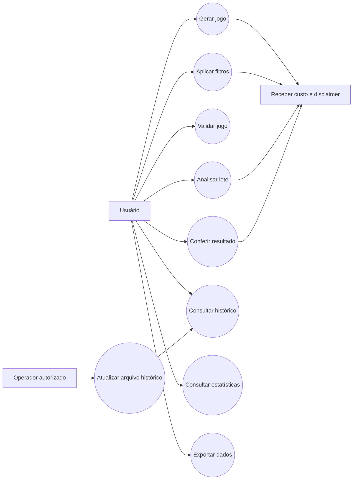
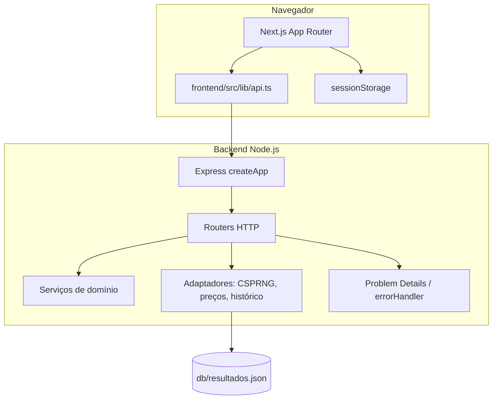
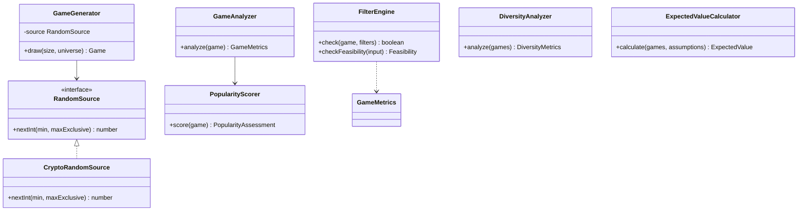
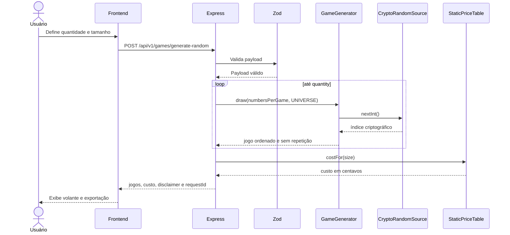
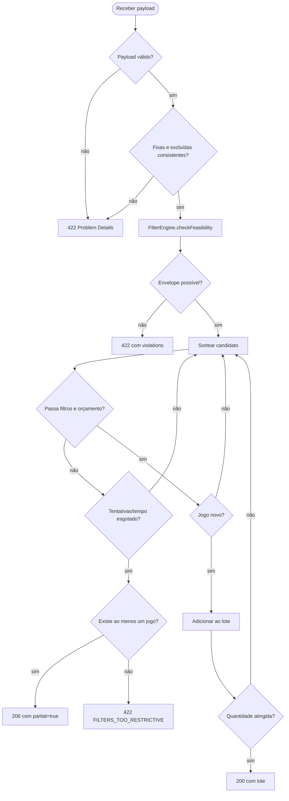
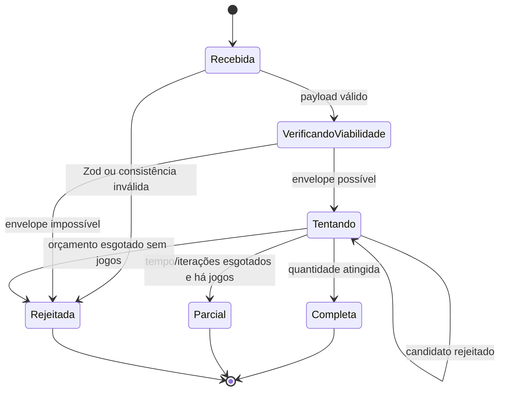
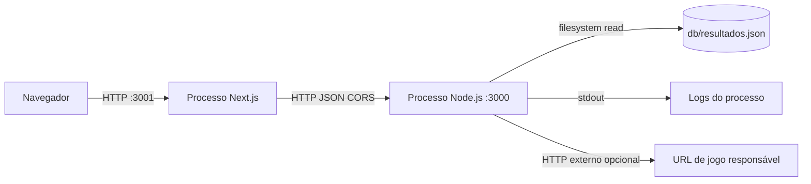
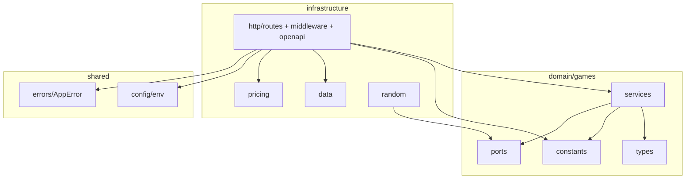
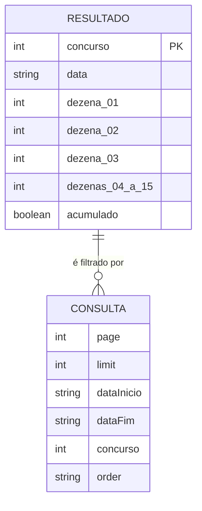

# Lotzy — gerador e analisador de jogos da Lotofácil

**Branch documentada:** `feature/v6`
**Versão declarada nos manifests:** `3.0.0`
**Idioma da documentação:** português
**Estado desta documentação:** descreve o código efetivamente presente nesta branch, incluindo limitações conhecidas e riscos pendentes.

[](./backend)
[](./backend)
[](./frontend)
[](https://www.typescriptlang.org/)
[](https://vitest.dev/)

> **Aviso de responsabilidade.** O Lotzy organiza combinações, calcula custos e descreve métricas. Ele não prevê sorteios, não identifica dezenas mais prováveis e não aumenta a probabilidade de premiação. Todas as combinações simples válidas de 15 dezenas são equiprováveis. A aplicação deve ser usada apenas para fins informacionais e com limites financeiros definidos.

## Sumário

- [1. Visão executiva](#1-visão-executiva)
- [2. Escopo funcional](#2-escopo-funcional)
- [3. Arquitetura](#3-arquitetura)
- [4. Diagramas UML](#4-diagramas-uml)
- [5. Estrutura completa do repositório](#5-estrutura-completa-do-repositório)
- [6. Tecnologias e dependências](#6-tecnologias-e-dependências)
- [7. Pré-requisitos e configuração](#7-pré-requisitos-e-configuração)
- [8. Instalação, execução e build](#8-instalação-execução-e-build)
- [9. API HTTP completa](#9-api-http-completa)
- [10. Regras de domínio e algoritmos](#10-regras-de-domínio-e-algoritmos)
- [11. Frontend: páginas, estado e uso](#11-frontend-páginas-estado-e-uso)
- [12. Dados históricos](#12-dados-históricos)
- [13. Testes e validação](#13-testes-e-validação)
- [14. Gaps, vulnerabilidades e riscos](#14-gaps-vulnerabilidades-e-riscos)
- [15. Melhorias recomendadas](#15-melhorias-recomendadas)
- [16. Operação e solução de problemas](#16-operação-e-solução-de-problemas)
- [17. Contribuição](#17-contribuição)
- [18. Licença e referências](#18-licença-e-referências)

## 1. Visão executiva

O Lotzy é um monorepo TypeScript com duas aplicações independentes: uma API Express stateless no diretório `backend/` e uma interface Next.js no diretório `frontend/`. A raiz contém scripts de conveniência, o histórico oficial em JSON fica em `db/resultados.json`, e os documentos de especificação ficam em `plan/`.

A API expõe geração aleatória e filtrada, validação, análise de lotes, expansão combinatória, conferência de jogos, fechamentos pré-computados, carteiras diversificadas, estatísticas históricas, cálculo de valor esperado, projeção de orçamento e exportações. O frontend consome a API pelo navegador e mantém alguns estados temporários no `sessionStorage`; ele não possui autenticação nem persistência de usuário no servidor.

A arquitetura atual não usa banco de dados, fila, cache distribuído, conta de usuário ou serviço externo obrigatório. O histórico é um arquivo JSON local lido em tempo de requisição. Essa escolha simplifica a execução local, mas cria limitações importantes para concorrência, atualização de dados, escala horizontal e governança de produção.

### O que está implementado

| Área | Capacidades disponíveis |
|---|---|
| Geração | Jogos uniformes com 15–20 dezenas, unicidade opcional e CSPRNG por `node:crypto`. |
| Filtros | Dezenas fixas e excluídas, paridade, primos, Fibonacci, soma, moldura, sequência consecutiva, repetição do concurso anterior, popularidade heurística e sobreposição. |
| Análise | Soma, pares, primos, Fibonacci, moldura, miolo, maior sequência consecutiva e score de popularidade. |
| Carteira | Cobertura, sobreposição média/máxima/mínima, Jaccard, Gini e dezenas descobertas. |
| Combinatória | Expansão de jogos de 16–20 dezenas em combinações de 15; resposta JSON ou NDJSON. |
| Fechamento | Catálogo efetivo para `W(16,15,15)`, `W(17,15,15)` e `W(18,15,15)` por expansão completa. |
| Conferência | Conferência de jogos contra 15 dezenas informadas, com faixas de 11 a 15 acertos. |
| Histórico | Consulta paginada, filtros por data/concurso e exportação CSV, TXT, JSON ou SQL. |
| Estatísticas | Atrasos, temperatura, ciclos e sazonalidade histórica. |
| Ferramentas | Valor esperado, orçamento, simulação histórica, variações e tabela de preços. |
| Operação | `/health`, `/ready`, `/metrics`, `X-Request-Id`, Helmet, CORS, limite de corpo e rate limit. |

### O que não está implementado

Não há autenticação, autorização, cobrança, registro de apostas, notificações reais, sincronização automática com fonte oficial, banco de dados, observabilidade Prometheus completa, armazenamento de jogos do usuário, painel administrativo ou garantia de que os dados históricos estejam atualizados após o arquivo versionado na branch.

## 2. Escopo funcional

### Fluxo recomendado para uso local

1. Inicie a API na porta `3000`.
2. Inicie o frontend na porta `3001`.
3. Gere um lote aleatório ou configure filtros.
4. Valide e analise o lote.
5. Exporte os jogos ou confira-os contra um resultado informado.
6. Consulte custos, orçamento e disclaimers antes de qualquer decisão fora da aplicação.

### Princípio matemático

O universo é formado pelas dezenas de `1` a `25`. Uma aposta simples contém `15` dezenas. O número de combinações simples é:

\[
\binom{25}{15}=3.268.760
\]

Um jogo com `k` dezenas representa `C(k,15)` apostas simples. A tabela implementada usa preço de `350` centavos por aposta simples e valores fixos informativos de `700`, `1.400` e `3.500` centavos para 11, 12 e 13 acertos. As faixas de 14 e 15 acertos são tratadas como pari-mutuel e dependem do rateio do concurso.

Filtros restringem o espaço amostral. Eles podem alterar a composição e a distribuição do lote, mas não tornam uma combinação individual mais provável. O score de popularidade tenta modelar padrões que podem ser escolhidos por muitas pessoas; ele é heurístico, não foi validado empiricamente contra uma base de apostas reais e não é um modelo do sorteio.

## 3. Arquitetura

### Visão em camadas

```text
Navegador / cliente HTTP
        │
        ▼
Next.js + React                 Express 5
        │                             │
        │                             ├─ request id
        │                             ├─ Helmet
        │                             ├─ CORS
        │                             ├─ body limit
        │                             └─ rate limit
        │                             │
        └──────────────► API versionada /api/v1
                                      │
                                      ├─ Zod: validação de entrada
                                      ├─ rotas HTTP
                                      ├─ serviços de domínio
                                      ├─ adaptador CSPRNG
                                      ├─ tabela estática de preços
                                      └─ leitor do histórico JSON
```

`backend/src/app.ts` compõe o Express e injeta os routers. As regras matemáticas ficam em `domain/games`. Os adaptadores de HTTP, preços, aleatoriedade e dados ficam em `infrastructure`. O tratamento de erros converte erros do Zod e `AppError` para JSON compatível com o padrão Problem Details.

A API não cria estado de usuário. O único estado mutável do processo é o cache de atrasos por uma hora; o histórico é relido do arquivo a cada chamada. Em produção com múltiplas réplicas, o rate limit atual não é compartilhado entre instâncias.

## 4. Diagramas UML

Os diagramas abaixo usam Mermaid, que pode ser renderizado diretamente por visualizadores compatíveis com Markdown. Eles documentam casos de uso, componentes, classes, sequência, atividade, estados, implantação, pacotes e o modelo lógico dos dados.

### 4.1 Diagrama de casos de uso



### 4.2 Diagrama de componentes



### 4.3 Diagrama de classes do domínio



### 4.4 Sequência: geração aleatória



### 4.5 Atividade: geração filtrada



### 4.6 Estados de uma requisição de geração filtrada



### 4.7 Diagrama de implantação



### 4.8 Diagrama de pacotes



### 4.9 Modelo lógico dos dados históricos



O diagrama representa o modelo lógico normalizado exposto pela API. O arquivo físico não é uma tabela relacional: ele usa o objeto `{"Todos os Resultados": [...]}` com uma linha de cabeçalho seguida de arrays legados.

## 5. Estrutura completa do repositório

```text
app-lotzy/
├── .DS_Store                         # artefato de sistema; não deve ser versionado
├── .env.example                      # variáveis de ambiente de referência
├── .gitignore                        # exclusões do Git
├── README.md                         # este documento
├── package.json                      # scripts do monorepo
├── backend/
│   ├── package.json                  # scripts e dependências da API
│   ├── package-lock.json             # lockfile npm da API
│   ├── tsconfig.json                 # TypeScript da API e testes
│   ├── tsconfig.build.json           # arquivos incluídos no build distribuível
│   ├── vitest.config.ts              # configuração de testes
│   ├── src/
│   │   ├── app.ts                    # composição do Express
│   │   ├── server.ts                 # processo HTTP e shutdown
│   │   ├── domain/games/
│   │   │   ├── constants.ts          # universo, conjuntos e combinatória
│   │   │   ├── types.ts              # contratos do domínio
│   │   │   ├── ports/RandomSource.ts # porta para aleatoriedade injetável
│   │   │   └── services/             # regras matemáticas e heurísticas
│   │   ├── infrastructure/
│   │   │   ├── data/results.ts       # leitura/escrita do histórico JSON
│   │   │   ├── http/routes/           # endpoints HTTP
│   │   │   ├── http/middlewares/      # tratamento de erros
│   │   │   ├── http/openapi/          # documento OpenAPI mínimo
│   │   │   ├── pricing/               # tabela estática de preços
│   │   │   └── random/                # adaptador CSPRNG
│   │   ├── scripts/update-results.ts # atualização manual do histórico
│   │   └── shared/
│   │       ├── config/env.ts         # schema de configuração Zod
│   │       └── errors/AppError.ts     # erros de aplicação tipados
│   └── test/                         # testes unitários e HTTP
├── frontend/
│   ├── package.json                  # scripts e dependências Next.js
│   ├── package-lock.json             # lockfile npm do frontend
│   ├── next-env.d.ts                 # tipos gerados/referenciados pelo Next
│   ├── next.config.ts                # configuração Next.js
│   ├── tsconfig.json                 # TypeScript do frontend
│   └── src/
│       ├── app/                      # páginas App Router e CSS global
│       ├── components/               # navegação e volante
│       └── lib/api.ts                # cliente HTTP, schemas e utilitários
├── db/resultados.json                # histórico legado versionado
└── plan/                             # especificações de produto e arquitetura
```

### Inventário arquivo a arquivo

#### Raiz

| Arquivo | Responsabilidade e observações |
|---|---|
| `.DS_Store` | Metadado criado pelo macOS. Não participa da execução e deve ser removido do repositório; o `.gitignore` deveria bloqueá-lo. |
| `.env.example` | Define `NODE_ENV`, porta, CORS, rate limit, URL de jogo responsável e versões de catálogo. Não contém segredo. `LOG_LEVEL` aparece como referência histórica, mas não é lido pelo schema atual. |
| `.gitignore` | Evita artefatos comuns, dependências, builds e arquivos de ambiente. Deve incluir explicitamente `.DS_Store`, se ainda não incluir. |
| `package.json` | Expõe `dev`, `dev:frontend`, `build`, `test` e `typecheck`. O script raiz delega à API e, no build, a API delega ao frontend. |
| `README.md` | Documentação operacional, contratos, diagramas, riscos e recomendações desta branch. |

#### Backend: configuração e processo

| Arquivo | Responsabilidade e observações |
|---|---|
| `backend/package.json` | Declara Node `>=20`, scripts de desenvolvimento, teste, typecheck, lint e build. O script `lint` referencia ESLint, mas ESLint não está declarado nas dependências. |
| `backend/package-lock.json` | Fixa a árvore de dependências da API. Deve ser regenerado quando dependências forem atualizadas. |
| `backend/tsconfig.json` | Configuração TypeScript estrita para desenvolvimento e testes. |
| `backend/tsconfig.build.json` | Configuração do build de produção; exclui testes e gera `dist/`. |
| `backend/vitest.config.ts` | Configura o Vitest usado pelos quatro arquivos de teste. |
| `backend/src/server.ts` | Cria o app, escuta na porta configurada e implementa shutdown gracioso para `SIGTERM` e `SIGINT`, com timeout de 10 segundos. |
| `backend/src/app.ts` | Monta middlewares, request ID, Helmet, CORS, parsing JSON/texto, rotas operacionais, rate limit padrão/pesado e `errorHandler`. A rota de lote aceita `multipart/form-data` no parser textual, mas não implementa parser multipart; isso é um gap de contrato. |
| `backend/src/shared/config/env.ts` | Valida ambiente com Zod. Converte porta e limites para números, CORS para lista e `API_KEYS` para `Set`. `API_KEYS` é reservado e não protege nenhuma rota atualmente. |
| `backend/src/shared/errors/AppError.ts` | Define erros de negócio com código, status HTTP e extensões serializáveis. |
| `backend/src/infrastructure/http/middlewares/errorHandler.ts` | Converte `ZodError` em 422 com `invalidParams`, `AppError` em Problem Details e erros desconhecidos em 500. O erro desconhecido também é enviado ao `console.error`. |
| `backend/src/infrastructure/http/openapi/openapi.ts` | Publica um OpenAPI 3.1 mínimo com nomes e resumos de rotas. Não contém schemas completos, parâmetros, respostas ou exemplos suficientes para geração confiável de clientes. |

#### Backend: domínio

| Arquivo | Responsabilidade e observações |
|---|---|
| `constants.ts` | Define universo 1–25, tamanhos mínimo/máximo, conjuntos de primos, Fibonacci, moldura e funções de combinação. |
| `types.ts` | Define `Game`, `Range`, filtros, avaliação de popularidade, métricas e violações de viabilidade. |
| `ports/RandomSource.ts` | Abstrai `nextInt` para permitir teste determinístico e troca do provedor de aleatoriedade. |
| `GameGenerator.ts` | Faz amostragem sem reposição com embaralhamento parcial e retorna o jogo ordenado. |
| `FilterEngine.ts` | Confere filtros e calcula envelopes alcançáveis para paridade, primos, Fibonacci, moldura e soma. Não prova todos os filtros combinados; popularidade e sobreposição são tratados por tentativa. |
| `GameAnalyzer.ts` | Calcula tamanho, soma, paridade, primos, Fibonacci, moldura, miolo, sequência máxima e popularidade. |
| `PopularityScorer.ts` | Detecta padrões geométricos, aritméticos, calendáricos e composicionais. Combina pesos por grupo com um complemento multiplicativo e rotula a confiança como heurística. |
| `DiversityAnalyzer.ts` | Calcula cobertura por dezena, overlaps, Jaccard, Gini e dezenas não cobertas. |
| `CombinationExpander.ts` | Gerador lazy de combinações `C(n,k)`, usado para expansão e fechamento. |
| `ExpectedValueCalculator.ts` | Calcula probabilidades analíticas e retorno esperado. A parte condicional depende das premissas informadas pelo cliente. |

#### Backend: infraestrutura e rotas

| Arquivo | Responsabilidade e observações |
|---|---|
| `infrastructure/random/CryptoRandomSource.ts` | Adapta `crypto.randomInt`; não usa `Math.random()`. |
| `infrastructure/pricing/StaticPriceTable.ts` | Centraliza versão da tabela, preço da aposta simples e prêmios fixos. Valores podem ficar desatualizados frente à operadora oficial. |
| `infrastructure/data/results.ts` | Localiza o JSON em dois caminhos possíveis, normaliza datas e linhas, lê 15 dezenas e oferece `appendResult` com arquivo temporário e rename. `clearResultsCache` é apenas documentação, pois não há cache de leitura. |
| `http/routes/api.routes.ts` | Router principal de geração, filtros, validação, análise, expansão, conferência, variações, valor esperado, orçamento e simulação histórica. Também contém schemas e instâncias dos serviços. |
| `http/routes/advanced.routes.ts` | Implementa fechamento `wheel` e carteira `portfolio`. O catálogo de wheel é efetivamente expansão completa para os tamanhos suportados. |
| `http/routes/history.routes.ts` | Lista e exporta histórico com filtros, paginação e validação manual de query string. |
| `http/routes/stats.routes.ts` | Implementa atrasos, temperatura, ciclos e geração orientada ao ciclo. Usa cache de uma hora apenas para atrasos. |
| `http/routes/phase2.routes.ts` | Implementa sazonalidade, tabela de preços e comparação informativa com Mega-Sena. |
| `http/routes/lote.routes.ts` | Analisa lote textual linha a linha, com parsing de espaços, vírgulas ou delimitadores equivalentes. |
| `http/routes/format.ts` | Serializa jogos para CSV, TXT, JSON, NDJSON e SQL e define `Content-Disposition`. |
| `http/routes/openapi/openapi.ts` | Documento estático do contrato. |
| `src/scripts/update-results.ts` | Script manual de atualização do arquivo histórico; deve ser executado com cuidado porque modifica um arquivo versionado. |

#### Backend: testes

| Arquivo | Cobertura |
|---|---|
| `test/domain.test.ts` | Gerador, invariantes, viabilidade, score de popularidade e expansão. |
| `test/api.test.ts` | Health, request ID, geração, filtros, validação 422, envelope inviável, resposta parcial, sorteio duplicado e histórico. |
| `test/phase1.test.ts` | Estatísticas, ciclo, simulação, exportação e conferência textual. |
| `test/phase2.test.ts` | Sazonalidade, tabela de preços, variações, orçamento e wheels W17/W18. |

#### Frontend

| Arquivo | Responsabilidade |
|---|---|
| `frontend/package.json` | Scripts `dev`, `build`, `start` e `lint`; usa Next 15, React 19, Zod e TypeScript. |
| `frontend/package-lock.json` | Lockfile do frontend. |
| `frontend/next.config.ts` | Configuração atual do Next sem regras customizadas relevantes. |
| `frontend/tsconfig.json` | TypeScript com alias `@/*` para `src/*`. |
| `frontend/next-env.d.ts` | Referências de tipos geradas pelo Next. |
| `frontend/src/app/layout.tsx` | Layout raiz, metadata, idioma `pt-BR`, navegação e aviso de responsabilidade. |
| `frontend/src/app/globals.css` | Sistema visual, layout responsivo, cartões, botões, volante, tabelas e estados de erro. |
| `frontend/src/app/page.tsx` | Página inicial de geração aleatória, validação automática e redirecionamento para análise. |
| `frontend/src/app/aux-pages.tsx` | Componentes client-side compartilhados por ajuda, filtros e análise, incluindo `PageShell`, `FiltersPage`, `AnalyzePage` e `HelpPage`. |
| `frontend/src/app/montar/page.tsx` | Montagem de jogo filtrado, incluindo fixas, excluídas e soma. |
| `frontend/src/app/filtros/page.tsx` | Exporta a tela de filtros compartilhada. |
| `frontend/src/app/analisar/page.tsx` | Exporta a tela de análise compartilhada; lê lote validado do `sessionStorage`. |
| `frontend/src/app/ajuda/page.tsx` | Exporta a tela de ajuda compartilhada. |
| `frontend/src/app/conferir/page.tsx` | Confere jogos individuais ou lote textual contra dezenas sorteadas. |
| `frontend/src/app/estatisticas/page.tsx` | Exibe atrasos, temperatura, ciclos e geração orientada ao ciclo. |
| `frontend/src/app/history/page.tsx` | Página server wrapper do histórico. |
| `frontend/src/app/history/HistoryClient.tsx` | Cliente de filtros, paginação e consulta do histórico. |
| `frontend/src/app/bolao/page.tsx` | Tela de bolão/carteira na interface; conferir o código antes de tratá-la como integração com grupo real. |
| `frontend/src/app/meus-jogos/page.tsx` | Lista local de jogos salvos no navegador, quando presentes. |
| `frontend/src/app/imprimir/page.tsx` | Formata jogos do armazenamento local para impressão. |
| `frontend/src/app/notificacoes/page.tsx` | Tela de notificações locais; não há backend de push ou agendamento. |
| `frontend/src/components/Navigation.tsx` | Menu principal com links para as áreas da aplicação. |
| `frontend/src/components/PlayslipGrid.tsx` | Volante 5×5 para exibição/interação de dezenas. |
| `frontend/src/lib/api.ts` | Cliente `fetch`, schemas Zod de respostas, tipos, parsers de números, helpers de moeda e endpoints. A URL pública é lida de `NEXT_PUBLIC_API_URL`. |

#### Dados e planos

| Arquivo | Responsabilidade |
|---|---|
| `db/resultados.json` | Base legada versionada com 3.782 resultados na validação realizada nesta branch; deve ser validada e atualizada antes de uso operacional. |
| `plan/SSD-lotofacil-api-2.md` | Especificação principal da API, premissas matemáticas, requisitos funcionais e fases. |
| `plan/SSD-lotzy-frontend.md` | Especificação de experiência e interface do frontend. |
| `plan/SSD-lotzy-v3.md` | Plano resumido de evolução da versão anterior. |

## 6. Tecnologias e dependências

| Camada | Tecnologia | Uso |
|---|---|---|
| Runtime | Node.js `>=20` | Execução da API e scripts. |
| Backend | TypeScript `5.9` em modo strict | Tipagem e compilação. |
| Backend | Express `5.1` | HTTP e roteamento. |
| Backend | Zod `4.1` | Schemas de payload e ambiente. |
| Backend | Helmet, CORS, express-rate-limit | Cabeçalhos, origens e limitação de requisições. |
| Backend | pino-http, prom-client | Dependências previstas para logging/métricas; o código atual usa métrica estática e `console`. |
| Testes | Vitest e Supertest | Testes unitários e HTTP. |
| Frontend | Next.js `15.5.4`, React `19` | App Router e renderização. |
| Frontend | Zod | Validação das respostas principais. |
| Dados | JSON versionado | Histórico local. |

## 7. Pré-requisitos e configuração

### Pré-requisitos

- Node.js 20 ou superior.
- npm 10 ou superior.
- Git.
- `curl` é opcional para chamadas manuais.
- Não é necessário banco, Docker ou credencial externa para o fluxo local atual.

### Variáveis do backend

Copie `.env.example` para `.env` na raiz. O processo pode ser iniciado da raiz por `npm run dev` ou de `backend/` por `npm run dev`.

| Variável | Padrão | Efeito |
|---|---:|---|
| `NODE_ENV` | `development` | Aceita `development`, `test` ou `production`. |
| `PORT` | `3000` | Porta HTTP da API. |
| `CORS_ORIGINS` | vazio | Lista separada por vírgulas. Vazio significa CORS permissivo no código atual. Em produção, configure explicitamente. |
| `RATE_LIMIT_WINDOW_MS` | `60000` | Janela do rate limit. |
| `RATE_LIMIT_MAX` | `100` | Limite padrão por IP/janela. Rotas pesadas usam 10. |
| `RESPONSIBLE_GAMBLING_URL` | URL gov.br | URL retornada nas respostas de geração. |
| `PRICE_TABLE_VERSION` | `2024-11-04` | Versão declarada da tabela. A constante de preço é estática. |
| `WHEEL_CATALOG_VERSION` | `wheels-2026-09` | Versão declarada do catálogo. |
| `POPULARITY_MODEL_VERSION` | `popularity-2026-09` | Versão declarada da heurística. |
| `API_KEYS` | vazio | Reservado para futura proteção; atualmente não autentica requests. |
| `LOG_LEVEL` | `info` no exemplo | Não é lido por `env.ts` nem controla logs atualmente. |

### Variável do frontend

Crie `frontend/.env.local` somente se a API não estiver no endereço padrão:

```env
NEXT_PUBLIC_API_URL=http://localhost:3000/api/v1
```

Como a variável começa por `NEXT_PUBLIC_`, ela é pública no bundle do navegador. Nunca coloque segredo, token ou chave privada nela.

## 8. Instalação, execução e build

### Clone da branch documentada

```bash
git clone --branch feature/v4 --single-branch https://github.com/barrosrafa/app-lotzy.git
cd app-lotzy
```

### Instalação e validação pelo monorepo

```bash
npm ci --prefix backend
npm ci --prefix frontend
npm run typecheck
npm test
npm run build
```

O `npm run build` da raiz chama `backend/npm run build`; esse script compila a API e executa `npm --prefix ../frontend run build`.

### Desenvolvimento

Terminal 1:

```bash
npm run dev
```

Terminal 2:

```bash
npm run dev:frontend
```

A API fica em `http://localhost:3000`. O frontend fica em `http://localhost:3001`.

### Execução compilada

```bash
cd backend
npm run build:api
npm start
```

Em outro terminal:

```bash
cd frontend
npm run build
npm start
```

### Exemplo de smoke test

```bash
curl -i http://localhost:3000/health
curl -s http://localhost:3000/api/v1/openapi.json | head
curl -X POST http://localhost:3000/api/v1/games/generate-random \
  -H 'Content-Type: application/json' \
  -d '{"quantity":2,"numbersPerGame":15}'
```

## 9. API HTTP completa

A base de negócio suporta tanto as rotas padronizadas sob `/api` quanto sob `/api/v1`. As respostas de negócio carregam `X-Request-Id`; o cliente pode enviar esse header para correlação. Payload inválido retorna `422` em `application/problem+json`, exceto a rota histórica, que faz validação manual e retorna `400` para query inválida.

### 9.0 Rotas REST Reorganizadas e Workers (Feature v6)

A branch `feature/v6` introduz uma camada otimizada de endpoints desacoplados, processamento assíncrono via `worker_threads` e integração com SWR no frontend:

| Método | Endpoint | Payload / Query | Descrição |
|---|---|---|---|
| `GET` | `/api/concursos/latest` | Nenhum | Retorna o último concurso registrado e estatísticas pré-calculadas em cache (`EstatisticaCache`: atrasos, ciclo, frequências e análise do último sorteio). |
| `POST` | `/api/jogos/desdobrar` | `{ dezenas: number[], regras?: { targetSize?: number, filters?: object, limit?: number }, format?: 'json' \| 'ndjson' }` | Executa expansão combinatória pesada desacoplada do event loop via `desdobrar.worker.ts`. |
| `POST` | `/api/jogos/simular` | `{ cartoes?: number[][], concursoInicio?: number, concursoFim?: number, historicDraws?: number[][] }` | Cruza cartões com o histórico oficial e calcula ROI, acertos por faixa (11 a 15) e saldo líquido via `simular.worker.ts`. |

#### Arquitetura de `worker_threads` (Fase 2)
As rotas de CPU pesada (`/api/jogos/desdobrar` e `/api/jogos/simular`) delegam sua execução a instâncias dedicadas de `WorkerPool` gerenciadas pelo Node.js.
- **Isolamento de CPU**: As rotas apenas despacham a mensagem e aguardam o resultado via `Promise`.
- **Proteção por Timeout**: Cada tarefa possui limite máximo de tempo de execução configurado (15 a 20 segundos). Caso o limite seja ultrapassado, o worker afetado é substituído e a requisição rejeitada com status HTTP `504` (`TASK_TIMEOUT`).
- **Cache de Estatísticas (`EstatisticaCache`)**: Centraliza os resultados da base local, mantendo índices pré-calculados em memória para resposta instantânea em `/api/concursos/latest`.

#### Frontend como visualizador com SWR (Fase 3)
O frontend consome as novas APIs com hooks SWR reativos (`useLatestConcurso`, `useDesdobrar`, `useSimular`):
- Cálculos residuais de combinação e probabilidades foram eliminados do cliente.
- Ao clicar em "Gerar Jogos" ou "Desdobrar", apenas um payload JSON é enviado ao servidor.
- Skeletons e estados de carregamento robustos foram implementados em telas como `/`, `/montar` e `/analisar`.

### 9.1 Operação

| Método | Endpoint | Comportamento |
|---|---|---|
| `GET` | `/health` | Retorna `{status:"ok"}`; liveness. |
| `GET` | `/ready` | Retorna checks estáticos de tabela e catálogo. Não verifica arquivo histórico, rede ou dependências externas. |
| `GET` | `/metrics` | Retorna apenas a métrica estática `lotzy_up 1`; não é um exporter completo. |
| `GET` | `/api/v1/openapi.json` | Retorna documento OpenAPI 3.1 mínimo. |

### 9.2 Geração e análise

| Método | Endpoint | Payload principal | Resposta |
|---|---|---|---|
| `POST` | `/games/generate-random` | `quantity` 1–500, `numbersPerGame` 15–20, `unique` | Jogos, custo, expected value parcial, disclaimer. Query `format`: `csv`, `txt`, `json`, `ndjson`, `sql`. |
| `POST` | `/games/generate-filtered` | Quantidade 1–100, fixas, excluídas, filtros e budget | `200`, ou `206` se parcial; `422` se inviável ou sem resultado. |
| `GET` | `/games/filters` | Nenhum | Catálogo resumido de filtros e domínios. |
| `GET` | `/games/patterns` | Nenhum | Padrões heurísticos, pesos e versão do modelo. |
| `POST` | `/games/validate` | `{game:number[]}` com 15–20 dezenas únicas | Jogo normalizado, custo, métricas e warnings. |
| `POST` | `/games/analyze` | `{games, page, pageSize}` | Métricas por página, agregados e diversidade. |
| `POST` | `/games/generate/variations` | `{game, count}` | Variações com sobreposição mínima implícita. |

#### Exemplo de geração filtrada

```bash
curl -X POST http://localhost:3000/api/v1/games/generate-filtered \
  -H 'Content-Type: application/json' \
  -d '{
    "quantity": 5,
    "numbersPerGame": 15,
    "fixedNumbers": [1, 2],
    "excludedNumbers": [24, 25],
    "filters": {
      "evens": {"min": 6, "max": 8},
      "sum": {"min": 170, "max": 220},
      "maxConsecutiveRun": 5,
      "maxPopularityScore": 0.7
    },
    "budget": {"maxAttemptsPerGame": 5000, "maxTotalMs": 1000}
  }'
```

`FilterEngine.checkFeasibility` calcula envelopes simples antes da amostragem. Ele não resolve uma otimização global de todos os filtros. Por isso, um filtro pode ser matematicamente possível e ainda terminar em `206` ou `422` quando o orçamento de tentativas/tempo for insuficiente.

### 9.3 Expansão, conferência e exportação

| Método | Endpoint | Detalhes |
|---|---|---|
| `POST` | `/games/expand` | Aceita 16–20 dezenas. JSON é recusado acima de 1.000 combinações; NDJSON é recomendado. Rate limit pesado. |
| `POST` | `/games/check` | Recebe `drawnNumbers` com 15 únicas e até 500 jogos. Informa hits e faixas. |
| `POST` | `/games/check/lote` | Recebe texto e `drawnNumbers` na query. Aceita linhas textuais; limite de corpo 2 MB. |
| `GET / POST` | Rotas de geração com `?format=` | Exportam CSV, TXT, JSON, NDJSON ou SQL conforme a rota. |
| `GET` | `/api/history?...&format=` | Exporta histórico em CSV, TXT, JSON ou SQL. |

No SQL exportado, os valores são interpolados como texto. O endpoint não executa o SQL, mas consumidores devem tratar o arquivo como saída gerada e revisar nomes de tabela, esquema e encoding antes de importar.

### 9.4 Carteira e fechamento

| Método | Endpoint | Detalhes |
|---|---|---|
| `POST` | `/games/portfolio` | Gera até 200 jogos com limites de overlap e popularidade. O orçamento é por iterações e milissegundos. Pode retornar `206`. |
| `POST` | `/games/wheel` | Aceita 16–22 dezenas, mas só atende garantias `W(16,15,15)`, `W(17,15,15)` e `W(18,15,15)`. A implementação expande todas as combinações. |

A garantia do wheel é condicional: se as 15 dezenas sorteadas estiverem dentro das dezenas escolhidas, um bilhete terá os acertos declarados. Ela não aumenta a probabilidade de o sorteio cair no conjunto escolhido.

### 9.5 Ferramentas informacionais

| Método | Endpoint | Detalhes |
|---|---|---|
| `POST` | `/tools/expected-value` | Retorno esperado analítico para faixas fixas e, opcionalmente, premissas de rateio. |
| `POST` | `/tools/bankroll-check` | Projeta quantidade de apostas, gasto e perda esperada para orçamento e horizonte. |
| `POST` | `/tools/simulate-historical` | Conta acertos de uma combinação em resultados históricos fornecidos pelo arquivo. Não é previsão. |
| `GET` | `/api/v1/tabela-precos` | Retorna versão, preço e prêmios fixos informativos. |
| `GET` | `/api/v1/comparison` | Comparativo informativo com Mega-Sena; não gera jogos para ela. |

### 9.6 Histórico e estatísticas

| Método | Endpoint | Query/payload |
|---|---|---|
| `GET` | `/api/history` | `dataInicio`, `dataFim`, `concurso`, `concursoMin`, `concursoMax`, `page`, `limit`, `order`, `format`. Limite efetivo 500. |
| `GET` | `/api/v1/stats/atrasos` | Sem parâmetros; cache público de uma hora. |
| `GET` | `/api/v1/stats/temperatura` | `janela` 10, 20 ou 50. |
| `GET` | `/api/v1/stats/ciclos` | Ciclos sequenciais que cobrem as 25 dezenas. |
| `POST` | `/api/v1/games/generate/ciclo` | `quantity` 1–100 e `numbersPerGame` 15–20. Inclui dezenas faltantes do ciclo atual. |
| `GET` | `/api/v1/stats/seasonal` | `month` de 1 a 12. |

### 9.7 Erros

Exemplo de erro de validação:

```json
{
  "type": "https://api.lotofacil.internal/errors/validation-failed",
  "title": "Unprocessable Entity",
  "status": 422,
  "detail": "Um ou mais campos do payload são inválidos.",
  "instance": "/api/v1/games/generate-random",
  "requestId": "exemplo-local-001",
  "invalidParams": [
    {"name": "quantity", "reason": "Too small: expected number to be >=1"}
  ]
}
```

Códigos de aplicação relevantes incluem `VALIDATION_FAILED`, `FILTERS_TOO_RESTRICTIVE`, `WHEEL_NOT_AVAILABLE` e `UNSUPPORTED_RESPONSE_SIZE`.

## 10. Regras de domínio e algoritmos

### Geração aleatória

`GameGenerator` usa amostragem sem reposição sobre `UNIVERSE`. `CryptoRandomSource` delega a `crypto.randomInt`, o que evita o uso de `Math.random()`. A API ordena cada jogo antes de retorná-lo. A unicidade de jogos é controlada por uma chave textual com dezenas separadas por hífen.

### Filtros

- **Pares:** conta dezenas divisíveis por 2.
- **Primos:** usa o conjunto fixo definido em `constants.ts`.
- **Fibonacci:** usa o subconjunto definido no domínio; é uma classificação de composição, não uma propriedade causal do sorteio.
- **Soma:** compara a soma total com intervalo inclusivo.
- **Moldura e miolo:** usam o volante 5×5.
- **Sequência:** mede a maior corrida de inteiros consecutivos após ordenar.
- **Repetição:** conta interseção com `previousDraw`.
- **Popularidade:** aplica pesos heurísticos por grupo e limita o score ao intervalo 0–1.
- **Sobreposição:** rejeita um candidato se ele exceder o overlap máximo com jogos aceitos anteriormente.

### Expansão combinatória

`expand(pool, 15)` gera todas as combinações de 15 sem materializar o gerador antes da rota decidir o formato. O número de jogos cresce rapidamente: `C(16,15)=16`, `C(17,15)=136`, `C(18,15)=816`, `C(19,15)=3.876` e `C(20,15)=15.504`. A rota NDJSON escreve em fatias, mas ainda cria o array `combos` completo antes de transmitir; isso limita o benefício de streaming para entradas maiores.

### Diversidade

A carteira calcula o overlap de cada par, o índice de Jaccard, a frequência de cada dezena e o coeficiente de Gini da cobertura. Esses números descrevem concentração e dispersão. Eles não mudam o valor esperado de cada aposta.

### Valor esperado

O cálculo separa prêmios fixos de 11–13 acertos e prêmios condicionais de 14–15. O cliente deve fornecer `jackpotCents`, `expectedWinners15`, `expectedWinners14` e `prize14Cents` para a parte condicional. Sem essas premissas, o retorno condicional é zero no cálculo.

## 11. Frontend: páginas, estado e uso

| URL | Página | Dados e comportamento |
|---|---|---|
| `/` | Gerar | Chama `generateRandom`, valida o lote com `validateAndAnalyzeBatch`, salva no `sessionStorage` e navega para `/analisar`. |
| `/montar` | Montar | Chama `generateFiltered` e `validateGame` para composição controlada. |
| `/filtros` | Filtros | Formulário compartilhado para opções de composição. |
| `/analisar` | Analisar | Lê `lotzy:validated-games` do `sessionStorage`, mostra soma média, desvio, popularidade e exportação local/API. |
| `/conferir` | Conferir | Usa `checkGames` e `checkGamesBatch`. |
| `/estatisticas` | Estatísticas | Usa atrasos, temperatura, ciclos e geração por ciclo. |
| `/history` | Histórico | Consulta API com filtros, paginação e ordenação. |
| `/bolao` | Bolão | Interface de carteira/bolão local; não há backend de participantes ou divisão financeira. |
| `/meus-jogos` | Meus jogos | Usa armazenamento local do navegador. |
| `/imprimir` | Imprimir | Prepara visualização de impressão a partir dos jogos locais. |
| `/notificacoes` | Notificações | Preferências locais; não envia push. |
| `/ajuda` | Ajuda | Explica o fluxo e a responsabilidade do usuário. |

O frontend usa App Router e páginas estáticas com componentes client-side onde há estado. `api.ts` valida a resposta principal de geração e histórico com Zod, mas várias funções retornam `unknown`; isso reduz a segurança de tipos nas telas avançadas. A URL da API é definida no build do frontend, não em runtime no navegador.

## 12. Dados históricos

`db/resultados.json` usa o formato legado:

```json
{
  "Todos os Resultados": [
    ["concurso", "data", "dezena 1", "...", "dezena 15"],
    [3782, "17/09/2026", 1, 2, 3, 4, 5, 6, 7, 8, 9, 10, 11, 12, 13, 14, 15]
  ]
}
```

`loadResults()` descarta linhas inválidas, normaliza datas para `YYYY-MM-DD`, ordena dezenas e força exatamente 15 números. A rota histórica aplica filtros e paginação após carregar o arquivo inteiro. `appendResult()` evita duplicar concurso, ordena as linhas e grava em arquivo temporário antes de renomear.

O script `backend/src/scripts/update-results.ts` é manual. Antes de executar, faça backup, valide origem e destino e confira o diff do JSON. Não existe autenticação ou endpoint HTTP para atualização, o que reduz a superfície pública, mas não substitui controle de acesso no host.

## 13. Testes e validação

A validação executada nesta atualização foi:

```text
backend: npm run typecheck  → aprovado
backend: npm test           → 4 arquivos, 27 testes aprovados
backend: npm run build:api  → aprovado
frontend: npm run build     → aprovado; 15 rotas geradas
```

O teste de frontend não possui suíte automatizada de componentes, acessibilidade ou integração de navegador. O backend cobre invariantes importantes, mas ainda há lacunas em exportações, limites de tamanho, concorrência, rate limit, CORS, autenticação futura e falhas do sistema de arquivos.

Para repetir:

```bash
cd backend && npm ci && npm run typecheck && npm test && npm run build:api
cd ../frontend && npm ci && npm run build
```

## 14. Gaps, vulnerabilidades e riscos

### 14.1 Vulnerabilidades de dependências

A auditoria realizada durante esta atualização, com `npm audit` após `npm ci`, reportou:

| Pacote/área | Resultado observado | Impacto e ação |
|---|---:|---|
| Backend | 2 vulnerabilidades moderadas | Investigar a árvore transitiva, atualizar lockfile e revisar changelogs antes de produção. |
| Frontend / Next.js | 1 crítica e 2 altas | A versão instalada era `next@15.5.4`; atualizar para a versão corrigida indicada pelo audit, testar build e revisar advisories de Server Components, cache, SSR e Image Optimization. |
| Frontend / PostCSS e sharp | Incluídos na cadeia do Next | Atualizar via Next e lockfile; não usar `npm audit fix --force` sem revisar possíveis mudanças de major. |
| prom-client | Aviso de pacote depreciado | Avaliar migração para `@prometheus-io/client` ou remover a dependência até que métricas reais sejam implementadas. |

A saída do audit é um retrato do momento da instalação. Rode novamente no CI e trate vulnerabilidades críticas/altas como bloqueadoras para deploy público. Não foi aplicado `npm audit fix --force` automaticamente porque isso pode alterar majors sem teste de regressão.

### 14.2 Gaps de segurança de aplicação

1. **CORS permissivo por padrão.** Quando `CORS_ORIGINS` está vazio, `cors` recebe `true`. Em produção isso permite qualquer origem. Defina uma lista explícita e teste preflight.
2. **Ausência de autenticação.** `API_KEYS` é apenas configuração não utilizada. Todos os endpoints são públicos para quem alcança a porta.
3. **Rate limit local.** O limitador é em memória. Em múltiplas réplicas, cada instância terá sua própria cota; use Redis ou outro store compartilhado.
4. **Observabilidade insuficiente.** `pino-http` e `prom-client` estão instalados, mas a implementação atual expõe uma métrica fixa e usa `console.error`; não há métricas de latência, erro, rejeições ou cardinalidade controlada.
5. **Proteção do histórico.** O script de atualização altera arquivo local e não possui trilha de auditoria, assinatura, validação de fonte ou lock de processo.
6. **SQL gerado sem contrato de esquema.** O export é útil como intercâmbio, mas nomes de tabela e tipos são fixos e não há escape/validação de integração com um banco.
7. **Upload declarado, não implementado.** `multipart/form-data` aparece no `express.text`, mas não há parser multipart nem fluxo de upload. Deve ser removido do content type aceito ou implementado corretamente.
8. **Mensagens de erro internas.** Erros desconhecidos são registrados no stdout; em produção, o logger deve controlar dados sensíveis, correlação e retenção.
9. **Dados no navegador.** Jogos podem ficar no `sessionStorage` e no armazenamento local. Não são dados secretos, mas o produto deve deixar explícito que qualquer script com acesso à origem pode lê-los.

### 14.3 Gaps de correção e produto

1. O OpenAPI é incompleto e não descreve os schemas reais.
2. Os valores de preço e prêmios são estáticos e podem não refletir a operadora.
3. O `wheel` declara catálogo versionado, mas resolve por expansão completa; não existe catálogo otimizado ou prova independente além do comportamento do código.
4. A heurística de popularidade não usa dados reais de apostas e o ganho anti-rateio retornado não está ligado a premissas completas em todas as rotas.
5. `generateFiltered` calcula viabilidade de alguns filtros individualmente; a combinação global pode continuar inviável.
6. A rota NDJSON materializa todas as combinações antes de escrever, portanto não é streaming de ponta a ponta.
7. A API de análise aceita jogos possivelmente não ordenados em alguns endpoints, embora a geração os ordene.
8. `HistoryResult.acumulado` é sempre `false` no parser; o arquivo não fornece esse estado de maneira confiável.
9. Não há testes de contrato entre frontend e backend.
10. A documentação de versão mistura branch `feature/v4` com versão de pacote `3.0.0`; deve existir uma política clara de versionamento.
11. O script de lint do backend não é executável em uma instalação limpa porque ESLint não está declarado no `package.json`.
12. O frontend anuncia recursos como notificações, bolão e meus jogos, mas eles são locais e não equivalem a contas, push ou colaboração multiusuário.

## 15. Melhorias recomendadas

### Prioridade P0 — antes de exposição pública

- Atualizar Next.js, PostCSS, sharp e dependências transitivas vulneráveis; registrar a versão corrigida no lockfile.
- Configurar `CORS_ORIGINS` de forma obrigatória em `production` e rejeitar configuração permissiva.
- Adicionar autenticação e autorização para endpoints administrativos e, se necessário, quotas por usuário.
- Mover rate limit para store compartilhado e limitar separadamente rotas de expansão, histórico e simulação.
- Remover o content type multipart não implementado.
- Adicionar limites de CPU, memória, tamanho de lote e tempo de resposta para todos os endpoints combinatórios.

### Prioridade P1 — robustez e manutenção

- Completar o OpenAPI com schemas, parâmetros, exemplos, erros e códigos `200/206/400/406/422/500`.
- Criar testes de contrato usando o OpenAPI e testes de integração do frontend.
- Adicionar ESLint e configuração compartilhada; corrigir o script `lint` e incluí-lo no CI.
- Implementar métricas reais com contadores, histogramas e endpoint protegido quando necessário.
- Fazer o parser de histórico validar intervalo de dezenas, duplicidade, datas e monotonicidade.
- Implementar leitura streaming real para expansão, evitando construir `combos` completo.
- Separar `api.routes.ts` em routers menores e extrair schemas/serviços das rotas.
- Substituir `unknown` no cliente frontend por schemas Zod específicos para cada endpoint.

### Prioridade P2 — evolução de produto

- Criar um adaptador de fonte oficial com ingestão idempotente, checksum, logs e revisão humana.
- Migrar histórico para banco relacional quando houver escrita concorrente ou necessidade de consulta por volume.
- Persistir jogos do usuário em conta autenticada somente se o produto realmente precisar desse recurso.
- Tornar tabela de preço e catálogo de wheels dados versionados com testes de contrato e data de vigência.
- Quantificar a heurística de popularidade com metodologia reproduzível e declarar intervalo de incerteza.
- Consolidar nomenclatura e versionamento entre branch, pacote, API e catálogos.
- Adicionar testes de acessibilidade, navegação por teclado, responsividade e smoke test em navegador.
- Remover ou rotular com mais clareza as telas que atualmente são apenas armazenamento local.

## 16. Operação e solução de problemas

### O frontend não acessa a API

Confirme que a API está em `localhost:3000`, que o frontend foi iniciado em `3001` e que `frontend/.env.local` aponta para `/api/v1`. Verifique também `CORS_ORIGINS` e o console do navegador.

### A API retorna 422 ao gerar com filtros

Leia `detail`, `invalidParams` ou `violations`. Se houver `OUT_OF_ACHIEVABLE_RANGE`, o envelope já provou que o filtro é impossível. Se houver `FILTERS_TOO_RESTRICTIVE`, reduza restrições ou aumente `budget.maxAttemptsPerGame` e `budget.maxTotalMs` dentro dos limites aceitos.

### A API retorna 206

A rota gerou pelo menos um jogo, mas não atingiu a quantidade dentro do orçamento. Use `meta.partial`, `attempts`, `acceptanceRate` e `rejectionsByConstraint` para diagnosticar.

### O histórico retorna 404

O processo não encontrou `db/resultados.json` no diretório de trabalho atual nem em seu pai. Inicie a API a partir da raiz ou de `backend/` conforme os caminhos suportados e confirme a existência do arquivo.

### O histórico retorna resultados estranhos

O parser espera a chave `Todos os Resultados`, uma linha de cabeçalho e rows com concurso, data e 15 números. Faça backup antes de editar e execute os testes de histórico.

### O build funciona, mas o lint falha

Na versão documentada, o backend declara `eslint` no script, mas não nas dependências. Instale e configure ESLint como melhoria pendente antes de tratar lint como gate de CI.

## 17. Contribuição

Antes de abrir uma alteração:

```bash
npm ci --prefix backend
npm ci --prefix frontend
npm run typecheck
npm test
npm run build
```

Toda mudança de regra matemática deve incluir teste determinístico e explicar se altera apenas composição, custo, variância ou alguma garantia condicional. Nenhuma documentação, interface ou resposta de API deve sugerir que um filtro aumenta a probabilidade do sorteio.

Toda mudança de endpoint deve atualizar a tabela deste README, o OpenAPI e os testes HTTP. Toda mudança de dependência deve atualizar o lockfile e registrar o resultado de `npm audit`.

### Checklist de pull request

- [ ] A mudança tem teste automatizado apropriado.
- [ ] Typecheck e build passam.
- [ ] O contrato OpenAPI foi atualizado.
- [ ] O README e os diagramas estão coerentes.
- [ ] Não há segredo, token ou `.env` versionado.
- [ ] Os limites de entrada e custo computacional foram revisados.
- [ ] A copy preserva o aviso de jogo responsável.
- [ ] Dependências novas foram auditadas.

## 18. Licença e referências

Não há arquivo de licença na raiz desta branch. O uso, redistribuição e contribuição devem ser definidos pelo mantenedor antes de publicar o projeto como software distribuível.

### Referências técnicas

[1]: https://nodejs.org/api/crypto.html "Node.js Crypto API"
[2]: https://expressjs.com/ "Express documentation"
[3]: https://zod.dev/ "Zod documentation"
[4]: https://nextjs.org/docs "Next.js documentation"
[5]: https://vitest.dev/guide/ "Vitest guide"
[6]: https://mermaid.js.org/intro/ "Mermaid documentation"
[7]: https://owasp.org/www-project-application-security-verification-standard/ "OWASP Application Security Verification Standard"
[8]: https://www.gov.br/saude/pt-br/assuntos/saude-de-a-a-z/j/jogo-patologico "Informações do Ministério da Saúde sobre jogo patológico"
[9]: https://github.com/barrosrafa/app-lotzy/tree/feature/v4 "Código-fonte da branch feature/v4"
[10]: ./plan/SSD-lotofacil-api-2.md "Especificação da API Lotofácil"
[11]: ./plan/SSD-lotzy-frontend.md "Especificação do frontend Lotzy"

A documentação técnica foi escrita a partir dos arquivos presentes na branch `feature/v4`, dos manifests, dos testes executados e da auditoria local de dependências. Os números de vulnerabilidades e resultados de build devem ser revalidados em cada pipeline, porque dependências e advisories mudam com o tempo.
