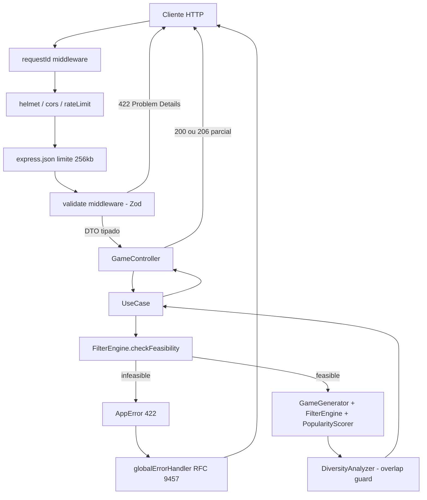

# System Specification Document — Lotofácil Number Generator API

| | |
|---|---|
| **Versão** | 3.0.0 — incorpora o plano de evolução (anti-rateio, fechamento, diversificação, EV) |
| **Status** | Fases 1–3 aprovadas para implementação; Fases 4–8 especificadas |
| **Stack** | Node.js 20 LTS · TypeScript 5.x (`strict`) · Express 5 · Zod 4 · Vitest |
| **Arquitetura** | Layered / Ports & Adapters (stateless) |
| **Idioma do código** | Inglês (identificadores, comentários, logs). Documentação em português. |

**Histórico**

| Versão | Mudança |
|---|---|
| 1.0.0 | Documentos de origem (`lotofacil.txt`, `LOTOFACIL2.txt`) |
| 2.0.0 | Correção da premissa estatística, Fisher-Yates, viabilidade de filtros, centavos, RFC 9457, remoção do módulo de rede neural |
| 3.0.0 | `popularityScore` e filtro anti-rateio; fechamento combinatório por catálogo; métricas de diversificação; calculadora de EV analítica; backtest com análise de poder; observabilidade |

---

## 0. Premissa (leia antes do capítulo 1)

Esta API **não aumenta a probabilidade de ganho em nenhuma faixa de premiação**. Todas as 3.268.760 combinações de 15 dezenas são equiprováveis e os sorteios são independentes. Nenhuma feature adicionada na v3.0.0 muda isso.

**Requisito de produto (RF-14):** nenhuma resposta da API, documentação, README ou copy de frontend pode afirmar, sugerir ou insinuar aumento de probabilidade. Toda resposta de geração carrega o campo `disclaimer`. Isso é requisito de conformidade, não sugestão de tom.

### 0.1. Correção do material de origem

Os documentos de entrada afirmam que os intervalos de filtro derivam de "frequência histórica dos concursos". Isso é falso. Os percentuais citados são as probabilidades *a priori* da distribuição hipergeométrica do próprio volante:

$$P(X = x) = \frac{\binom{K}{x}\binom{N-K}{n-x}}{\binom{N}{n}}, \quad N = 25,\ n = 15$$

| Filtro | Alegado nos anexos | $P$ calculada | Conclusão |
|---|---|---|---|
| 6–8 pares ($K=12$) | 77,38% | 77,38% | Idêntico |
| 4–6 primos ($K=9$) | 77,11% | 77,10% | Idêntico |
| 8–10 repetidas do anterior ($K=15$) | 78,92% | 78,93% | Idêntico |
| Soma 170–220 | 84,00% | ≈83,6% | Idêntico (normal aprox.) |

Se a frequência observada coincide com a probabilidade teórica até a segunda casa decimal, o dado **não carrega informação sobre os sorteios**. Aplicar o filtro remove ~23% do espaço amostral e ~23% da cobertura junto. O valor esperado permanece inalterado.

### 0.2. O que é matematicamente possível — com magnitudes

Esta seção existe para impedir que a v3.0.0 substitua o overclaim dos anexos por um overclaim mais sofisticado. Cada capacidade abaixo vem acompanhada da sua ordem de grandeza.

| Capacidade | Natureza | Ganho real | Onde está |
|---|---|---|---|
| Reduzir rateio nas faixas 14 e 15 | Probabilística, de segunda ordem | **≈ R$ 0,17 por aposta de R$ 3,50 em cenário otimista (< 5% do custo)** | §6.5, §7.9 |
| Garantir cobertura mínima condicional | **Determinística** — matemática discreta, não estatística | Garantia rígida, mas condicional a um evento cuja probabilidade é ela própria pequena | §6.6, §7.10 |
| Diversificar a carteira | Redução de variância | Aumenta $P(\text{ao menos um prêmio no lote})$; não muda o EV | §6.7, §7.11 |
| Expor o EV negativo | Informacional | Retorno esperado ≈ 45% do valor apostado | §2.4, §7.12 |

**Derivação do ganho anti-rateio.** Com $P(15) = 3{,}06 \times 10^{-7}$ e uma diferença otimista de R$ 500.000 no prêmio por ganhador entre um jogo "solitário" e um "concorrido":

$$\Delta EV_{15} = 3{,}06\times10^{-7} \times 500.000 = R\$\,0{,}153$$
$$\Delta EV_{14} = 4{,}59\times10^{-5} \times 400 = R\$\,0{,}018$$

Total ≈ R$ 0,17, ou 4,9% do custo da aposta. Para comparação, as faixas fixas de 11, 12 e 13 acertos devolvem R$ 0,898 por aposta **de forma determinística em esperança, sem nenhuma suposição** (§2.4). O filtro anti-rateio é real e vale a pena implementar, mas é cinco vezes menor que a parcela que ninguém precisa otimizar.

**Consequência de projeto (RF-20):** toda resposta que inclua `popularityScore` deve incluir também `expectedRateioGainCents`, calculado com as premissas explícitas do cliente. Score sem magnitude ao lado é desinformação.

---

## 1. Escopo

### 1.1. Requisitos funcionais

| ID | Requisito | Fase |
|---|---|---|
| RF-01 | Gerar N jogos aleatórios de $k \in [15,20]$ com CSPRNG | 3 |
| RF-02 | Gerar N jogos respeitando filtros de composição | 4 |
| RF-03 | Suportar dezenas fixas e excluídas | 4 |
| RF-04 | Validar formalmente um jogo informado | 5 |
| RF-05 | Analisar métricas de um lote | 5 |
| RF-06 | Desdobrar $n$ dezenas nas $\binom{n}{15}$ apostas simples | 6 |
| RF-07 | Calcular custo em centavos com tabela versionada | 3 |
| RF-08 | Conferir jogos contra resultado informado pelo cliente | 5 |
| RF-09 | Garantir unicidade dos jogos no lote | 3 |
| RF-10 | Pré-checar viabilidade dos filtros e falhar rápido | 4 |
| RF-11 | Expor `/health` e `/ready` | 1 |
| RF-12 | Expor OpenAPI 3.1 em `/api/v1/openapi.json` | 5 |
| RF-13 | Propagar `X-Request-Id` em respostas e logs | 1 |
| RF-14 | Incluir `disclaimer` em toda resposta de geração | 3 |
| **RF-15** | Calcular `popularityScore` de um jogo e expor o catálogo de padrões | 4b |
| **RF-16** | Filtrar geração por `maxPopularityScore` | 4b |
| **RF-17** | Expor métricas de diversificação (`overlap`, cobertura, entropia) de um lote | 5b |
| **RF-18** | Gerar carteira balanceada sob restrição de overlap máximo | 5b |
| **RF-19** | Servir sistemas de fechamento com garantia verificada, a partir de catálogo pré-computado | 6b |
| **RF-20** | Acompanhar todo `popularityScore` da magnitude de ganho estimada | 4b |
| **RF-21** | Calcular EV analítico das faixas fixas e EV condicional das faixas pari-mutuel | 7b |
| **RF-22** | Executar backtest stateless com análise de poder estatístico obrigatória | 7b |
| **RF-23** | Projetar perda esperada acumulada a partir de orçamento informado | 7b |

### 1.2. Fora de escopo

| Item | Motivo |
|---|---|
| **Módulo de rede neural / LSTM** | Converge para a taxa-base de 15/25 = 0,60. Sem sinal aprendível. Ver ADR-005. |
| Integração com API da Caixa | O cliente informa `drawnNumbers` / `historicDraws`. Mantém statelessness. Reavaliar na Fase 9. |
| **Solver de covering design em tempo de request** | NP-difícil. Quebraria RNF-01 e a arquitetura stateless. Substituído por catálogo pré-computado (ADR-009). |
| **Inferência de popularidade a partir de ganhadores por faixa** | Problema inverso mal-posto. Pesquisa de Fase 9, não produto. Ver §6.5.3. |
| Persistência / histórico de jogos | Port `GameRepository` existe para plug futuro. |
| Autenticação de usuário | API key opcional, §10.2. |
| Registro/pagamento de apostas | Fora da jurisdição técnica. |

### 1.3. Requisitos não funcionais

| ID | Requisito | Critério de aceite |
|---|---|---|
| RNF-01 | Latência `generate-random`, 1.000 jogos | p99 < 50 ms (1 vCPU, sem I/O) |
| RNF-02 | Latência `generate-filtered`, 100 jogos, densidade ≥ 10% | p99 < 150 ms |
| RNF-03 | Geração com filtros nunca bloqueia indefinidamente | Orçamento de tentativas e tempo, §6.4 |
| RNF-04 | `expand` não bloqueia o event loop > 100 ms por fatia | NDJSON com `setImmediate` a cada 2.000 itens |
| RNF-05 | Cobertura de testes | ≥ 85% linhas; 100% em `domain/` |
| RNF-06 | Uniformidade do gerador | Qui-quadrado marginal **e** par a par, $\alpha = 0{,}01$ (§11.3) |
| RNF-07 | Stateless e horizontalmente escalável | Nenhum estado em processo além de constantes e catálogos imutáveis |
| RNF-08 | Zero `any` no código de produção | `strict: true` + ESLint `no-explicit-any` como erro |
| **RNF-09** | `wheel` responde do catálogo em O(1) | p99 < 30 ms; nenhuma busca combinatória em request |
| **RNF-10** | `portfolio-balanced` com N ≤ 200 | p99 < 500 ms; orçamento de iterações explícito |
| **RNF-11** | `domain/` não importa `node:crypto`, `express`, `zod` nem `pino` | Regra ESLint `no-restricted-imports` por diretório, verificada no CI |

---

## 2. Fundamentação matemática do domínio

### 2.1. Universo e combinatória

$$\mathcal{N} = \{1, \dots, 25\}, \quad k \in [15, 20], \quad \text{apostas simples} = \binom{k}{15}$$

| $k$ | $\binom{k}{15}$ | $P(\text{15 acertos})$ | Custo (R$ 3,50/aposta) |
|---:|---:|---:|---:|
| 15 | 1 | 1 em 3.268.760 | R$ 3,50 |
| 16 | 16 | 1 em 204.298 | R$ 56,00 |
| 17 | 136 | 1 em 24.035 | R$ 476,00 |
| 18 | 816 | 1 em 4.006 | R$ 2.856,00 |
| 19 | 3.876 | 1 em 843 | R$ 13.566,00 |
| 20 | 15.504 | 1 em 211 | R$ 54.264,00 |

> Dado de configuração, não constante de código. O preço já migrou de R$ 3,00 para R$ 3,50. Ver §9.2 e ADR-004.

### 2.2. Estatísticas descritivas (a priori, não históricas)

$$\mu = 15 \times 13 = 195, \qquad \sigma^2 = 15 \times 52 \times \frac{10}{24} = 325, \qquad \sigma = 18{,}03$$

Suporte da soma: $[120, 270]$.

| Conjunto | Elementos | $\lvert K \rvert$ | $E[X] = 15K/25$ |
|---|---|---:|---:|
| Pares | 2,4,…,24 | 12 | 7,2 |
| Ímpares | 1,3,…,25 | 13 | 7,8 |
| Primos $\mathcal{P}$ | 2,3,5,7,11,13,17,19,23 | 9 | 5,4 |
| Fibonacci $\mathcal{F}$ | 1,2,3,5,8,13,21 | 7 | 4,2 |
| Moldura (borda 5×5) | 16 dezenas | 16 | 9,6 |
| Miolo (centro 3×3) | 7,8,9,12,13,14,17,18,19 | 9 | 5,4 |

> `Fibonacci` não tem fundamento probabilístico distinto — é um subconjunto arbitrário de 7 elementos, como seria `{4,9,12,17,20,22,25}`. Mantido no contrato por demanda de usuário, marcado `nature: "cosmetic"` com `deprecationHint` (§7.3).

### 2.3. Faixas de premiação

| Acertos | Natureza | Valor |
|---|---|---|
| 15 | Pari-mutuel | Rateio do prêmio principal |
| 14 | Pari-mutuel | Rateio |
| 13 | Fixo | R$ 35,00 |
| 12 | Fixo | R$ 14,00 |
| 11 | Fixo | R$ 7,00 |

Apenas 14 e 15 justificam estratégia anti-rateio. As três faixas fixas não se beneficiam de diversificação, popularidade ou fechamento — o prêmio é o mesmo independentemente de quantos acertaram.

### 2.4. Distribuição de acertos e valor esperado

Para uma aposta simples de 15 dezenas, com $h$ = acertos:

$$P(h) = \frac{\binom{15}{h}\binom{10}{15-h}}{\binom{25}{15}}$$

| $h$ | Numerador | $P(h)$ | Prêmio | Contribuição ao EV |
|---:|---:|---:|---|---:|
| 11 | $1365 \times 210$ | 0,087695 | R$ 7,00 (fixo) | R$ 0,6139 |
| 12 | $455 \times 120$ | 0,016703 | R$ 14,00 (fixo) | R$ 0,2338 |
| 13 | $105 \times 45$ | 0,0014455 | R$ 35,00 (fixo) | R$ 0,0506 |
| 14 | $15 \times 10$ | $4{,}589\times10^{-5}$ | Rateio | depende |
| 15 | $1 \times 1$ | $3{,}059\times10^{-7}$ | Rateio | depende |
| ≤10 | — | 0,894110 | — | R$ 0,00 |

**Resultado central:** $P(\text{algum prêmio}) \approx 10{,}59\%$ por aposta, e as faixas fixas contribuem **R$ 0,8983 determinísticos em esperança** — 25,7% do custo de R$ 3,50, sem nenhuma premissa sobre rateio, jackpot ou número de ganhadores.

Com valores típicos observados (prêmio por ganhador de ~R$ 2.000.000 na faixa 15 e ~R$ 1.500 na faixa 14):

$$EV \approx 0{,}898 + 0{,}612 + 0{,}069 = R\$\,1{,}58 \quad \Rightarrow \quad \text{retorno} \approx 45\%$$

Essa é a base da calculadora de EV (§7.12) e a justificativa numérica do disclaimer da §16. A parcela determinística é reportada sempre; a parcela pari-mutuel só quando o cliente informa as premissas.

> **Reconciliação pendente:** o retorno computado deve ser confrontado com o percentual de arrecadação que a Caixa destina legalmente à premiação da Lotofácil. Divergência material indica erro na tabela de prêmios fixos ou nas premissas de rateio. Item de aceite da Fase 7b.

---

## 3. Arquitetura

### 3.1. Regra de dependência

```
infrastructure  →  application  →  domain
                                     ↑
                            (não depende de nada)
```

`domain/` não importa `express`, `zod`, `pino` nem `node:crypto`. A entropia entra pelo port `RandomSource`, o que torna o motor determinístico em teste via seed injetada. A regra é verificada por lint no CI (RNF-11), não por convenção.

### 3.2. Estrutura de diretórios

```text
src/
├── domain/                              # Puro. Sem framework, sem I/O.
│   └── games/
│       ├── constants.ts                 # UNIVERSE, PRIMES, FIBONACCI, FRAME, CORE, ROWS, COLUMNS
│       ├── types.ts
│       ├── ports/
│       │   ├── RandomSource.ts
│       │   ├── PriceTable.ts
│       │   └── WheelCatalog.ts          # v3: lookup de sistemas pré-computados
│       └── services/
│           ├── GameGenerator.ts         # Fisher-Yates parcial
│           ├── FilterEngine.ts          # avaliação + pré-checagem de viabilidade
│           ├── GameAnalyzer.ts          # métricas de um jogo
│           ├── PopularityScorer.ts      # v3: score anti-rateio
│           ├── DiversityAnalyzer.ts     # v3: overlap, cobertura, entropia
│           ├── PortfolioBuilder.ts      # v3: carteira sob overlap máximo
│           ├── WheelVerifier.ts         # v3: prova a garantia de um sistema
│           ├── CombinationExpander.ts   # desdobramento lexicográfico (generator)
│           ├── ExpectedValueCalculator.ts # v3: EV analítico + condicional
│           └── PrizeChecker.ts
├── application/
│   └── games/
│       ├── dto/
│       └── usecases/
│           ├── GenerateRandomGames.ts
│           ├── GenerateFilteredGames.ts
│           ├── ValidateGame.ts
│           ├── AnalyzeGames.ts
│           ├── ExpandCombinations.ts
│           ├── CheckGames.ts
│           ├── BuildPortfolio.ts        # v3
│           ├── ResolveWheel.ts          # v3
│           ├── ComputeExpectedValue.ts  # v3
│           └── RunBacktest.ts           # v3
├── infrastructure/
│   ├── http/
│   │   ├── controllers/ routes/ middlewares/ openapi/
│   ├── random/CryptoRandomSource.ts
│   ├── pricing/StaticPriceTable.ts
│   ├── wheels/StaticWheelCatalog.ts     # v3: JSON versionado, carregado no boot
│   ├── ratelimit/                       # v3: port + adapters memory | redis
│   └── telemetry/                       # v3: Prometheus + OpenTelemetry
├── shared/
│   ├── errors/
│   └── config/env.ts
├── app.ts
└── server.ts
```

### 3.3. Fluxo de requisição



---

## 4. Modelo de domínio

```typescript
// src/domain/games/types.ts

/** A validated Lotofácil ticket: 15–20 unique numbers in [1,25], ascending. */
export type Game = readonly number[];

export interface GameMetrics {
  readonly size: number;
  readonly sum: number;
  readonly evens: number;
  readonly odds: number;
  readonly primes: number;
  readonly primeNumbers: readonly number[];
  readonly fibonacci: number;
  readonly fibonacciNumbers: readonly number[];
  readonly frame: number;
  readonly core: number;
  readonly maxConsecutiveRun: number;
  /** v3. See PopularityScorer — a behavioural heuristic, not a probability. */
  readonly popularity: PopularityAssessment;
}

export interface PopularityAssessment {
  /** Bounded [0,1]. Higher means the ticket looks more like what humans pick. */
  readonly score: number;
  readonly matchedPatterns: readonly MatchedPattern[];
  /** Always "heuristic" in Fase 4b. Never "empirical" without validation data. */
  readonly confidence: 'heuristic';
}

export interface MatchedPattern {
  readonly key: string;
  readonly group: PatternGroup;
  readonly weight: number;
}

/** Patterns in the same group are correlated and must not stack. */
export type PatternGroup = 'geometric' | 'arithmetic' | 'calendar' | 'compositional';

export interface FilterSpec {
  readonly evens?: Range;
  readonly primes?: Range;
  readonly fibonacci?: Range;
  readonly sum?: Range;
  readonly frame?: Range;
  readonly maxConsecutiveRun?: number;
  readonly maxPopularityScore?: number;          // v3
  readonly maxOverlapWithBatch?: number;         // v3, in absolute numbers
  readonly repeatsFromPrevious?: { readonly previousDraw: Game } & Range;
}

export interface Range {
  readonly min?: number;
  readonly max?: number;
}
```

**Invariantes do agregado `Game`** — garantidos na fronteira, nunca reverificados no domínio:

1. `15 ≤ size ≤ 20`
2. Elementos em `[1, 25]`
3. Sem duplicatas
4. Ordenação crescente (forma canônica, permite comparação por `join(',')`)

---

## 5. Constantes

```typescript
// src/domain/games/constants.ts

export const UNIVERSE_MIN = 1;
export const UNIVERSE_MAX = 25;
export const UNIVERSE: readonly number[] = Object.freeze(
  Array.from({ length: 25 }, (_, i) => i + 1),
);

export const MIN_GAME_SIZE = 15;
export const MAX_GAME_SIZE = 20;
export const DRAW_SIZE = 15;

export const PRIMES: ReadonlySet<number> = new Set([2, 3, 5, 7, 11, 13, 17, 19, 23]);
export const FIBONACCI: ReadonlySet<number> = new Set([1, 2, 3, 5, 8, 13, 21]);
export const CORE: ReadonlySet<number> = new Set([7, 8, 9, 12, 13, 14, 17, 18, 19]);

/** 5x5 playslip geometry, used by the popularity scorer. */
export const ROWS: readonly (readonly number[])[] = Object.freeze([
  [1, 2, 3, 4, 5], [6, 7, 8, 9, 10], [11, 12, 13, 14, 15],
  [16, 17, 18, 19, 20], [21, 22, 23, 24, 25],
]);
export const COLUMNS: readonly (readonly number[])[] = Object.freeze([
  [1, 6, 11, 16, 21], [2, 7, 12, 17, 22], [3, 8, 13, 18, 23],
  [4, 9, 14, 19, 24], [5, 10, 15, 20, 25],
]);
export const DIAGONALS: readonly (readonly number[])[] = Object.freeze([
  [1, 7, 13, 19, 25], [5, 9, 13, 17, 21],
]);

export const MIN_SUM = 120;
export const MAX_SUM = 270;

/** Minimum possible intersection between two games of sizes a and b. */
export const minOverlap = (a: number, b: number): number => Math.max(0, a + b - UNIVERSE_MAX);
```

---

## 6. Algoritmos

### 6.1. Geração aleatória — Fisher-Yates parcial

```typescript
// src/domain/games/services/GameGenerator.ts
import type { RandomSource } from '../ports/RandomSource';

export class GameGenerator {
  constructor(private readonly random: RandomSource) {}

  /**
   * Draws `size` distinct numbers from `pool` using a partial Fisher-Yates
   * shuffle. Uniform over all C(pool.length, size) subsets, O(size) swaps.
   */
  public draw(size: number, pool: readonly number[]): number[] {
    if (size > pool.length) {
      throw new RangeError(`Cannot draw ${size} numbers from a pool of ${pool.length}.`);
    }

    const scratch = [...pool];
    for (let i = 0; i < size; i += 1) {
      const j = this.random.nextInt(i, scratch.length); // [i, length)
      [scratch[i], scratch[j]] = [scratch[j], scratch[i]];
    }

    return scratch.slice(0, size).sort((a, b) => a - b);
  }
}
```

```typescript
// src/infrastructure/random/CryptoRandomSource.ts
import { randomInt } from 'node:crypto';
import type { RandomSource } from '../../domain/games/ports/RandomSource';

/** crypto.randomInt uses rejection sampling internally — no modulo bias. */
export class CryptoRandomSource implements RandomSource {
  public nextInt(min: number, maxExclusive: number): number {
    return randomInt(min, maxExclusive);
  }
}
```

**Proibido:** `Math.random()`, `Date.now()` como entropia, LCG caseiro. Lint bloqueando `Math.random` em `src/`.

Seed determinística via `SeededRandomSource` é permitida **apenas** quando `NODE_ENV === 'test'`; em produção o container de DI nem registra o adapter (ADR-011).

### 6.2. Pré-checagem de viabilidade — falhar em O(1), não em timeout

```typescript
// src/domain/games/services/FilterEngine.ts (trecho)

public checkFeasibility(input: FeasibilityInput): Feasibility {
  const { size, pool, fixed, filters } = input;
  const free = size - fixed.length;
  const candidates = pool.filter((n) => !fixed.includes(n));
  const violations: FeasibilityViolation[] = [];

  if (fixed.length > size) {
    violations.push({ constraint: 'fixedNumbers', reason: 'MORE_FIXED_THAN_SIZE' });
  }
  if (pool.length < size) {
    violations.push({ constraint: 'excludedNumbers', reason: 'POOL_TOO_SMALL' });
  }

  if (filters.sum && violations.length === 0) {
    const ascending = [...candidates].sort((a, b) => a - b);
    const base = fixed.reduce((acc, n) => acc + n, 0);

    // `free === 0` is a real case (fixed.length === size). Array.slice(-0)
    // returns the WHOLE array, so the negative-index form must be guarded.
    const lowest = free > 0 ? ascending.slice(0, free) : [];
    const highest = free > 0 ? ascending.slice(ascending.length - free) : [];

    const minSum = base + lowest.reduce((a, b) => a + b, 0);
    const maxSum = base + highest.reduce((a, b) => a + b, 0);

    if (disjoint({ min: minSum, max: maxSum }, filters.sum)) {
      violations.push({
        constraint: 'sum',
        reason: 'OUT_OF_ACHIEVABLE_RANGE',
        achievable: { min: minSum, max: maxSum },
      });
    }
  }

  // Same envelope check for evens / primes / fibonacci / frame.

  return { feasible: violations.length === 0, violations };
}
```

Envelope de cardinalidade para um conjunto-alvo $T$, pool efetivo $P$ e fixos $F$:

$$\text{max} = \min\!\big(k,\ |F \cap T| + |(P \setminus F) \cap T|\big), \qquad \text{min} = \max\!\big(|F \cap T|,\ k - |P \setminus T|\big)$$

Interseção vazia com o intervalo pedido → `422` imediato, devolvendo o envelope alcançável.

> **Correção v3.0.0:** `slice(-free)` com `free === 0` retornava o array inteiro (JavaScript trata `-0` como `0`), produzindo `maxSum` inflado e aceitando pedidos inviáveis quando todas as dezenas são fixas. Corrigido acima; caso coberto por teste (§11.2).

### 6.3. Geração filtrada — rejection sampling com orçamento

```typescript
export interface GenerationBudget {
  readonly maxAttemptsPerGame: number;  // default 5_000
  readonly maxTotalMs: number;          // default 1_000
}

export interface GenerationOutcome {
  readonly games: Game[];
  readonly requested: number;
  readonly attempts: number;
  readonly partial: boolean;            // true => HTTP 206
  readonly acceptanceRate: number;
  readonly rejectionsByConstraint: Record<string, number>;  // v3: diagnóstico
}
```

Regras:

- Deduplicação por chave canônica `game.join('-')`.
- **v3:** se `maxOverlapWithBatch` estiver definido, cada candidato é comparado aos já aceitos; rejeição conta em `rejectionsByConstraint.overlap`.
- Orçamento estourado com ao menos um jogo → **206 Partial Content**, `meta.partial: true`.
- Orçamento estourado com zero jogos → **422 `FILTERS_TOO_RESTRICTIVE`**.
- **v3:** `rejectionsByConstraint` é obrigatório na resposta. `acceptanceRate` sozinha diz que falhou; a quebra por restrição diz **qual** filtro afrouxar.

### 6.4. Desdobramento combinatório

```typescript
// src/domain/games/services/CombinationExpander.ts

/** Lazily yields every k-subset of `pool` in lexicographic order. */
export function* expand(pool: readonly number[], k: number): Generator<number[]> {
  const n = pool.length;
  if (k > n) return;

  const idx = Array.from({ length: k }, (_, i) => i);

  for (;;) {
    yield idx.map((i) => pool[i]);

    let i = k - 1;
    while (i >= 0 && idx[i] === i + n - k) i -= 1;
    if (i < 0) return;

    idx[i] += 1;
    for (let j = i + 1; j < k; j += 1) idx[j] = idx[j - 1] + 1;
  }
}
```

Transporte: `Accept: application/x-ndjson` streama linha a linha, com `await setImmediate()` a cada 2.000 itens (RNF-04). `application/json` só é aceito quando $\binom{n}{15} \le 1000$; acima, `406`.

### 6.5. Score de popularidade (v3) — modelo de concorrência, não de sorteio

#### 6.5.1. O que o score é e o que não é

O `popularityScore` estima **quão provável é que outros apostadores tenham marcado o mesmo bilhete**. Não estima nada sobre o sorteio. Seu único efeito é sobre o rateio das faixas 14 e 15, na magnitude da §0.2 (≈ R$ 0,17 por aposta em cenário otimista).

**Limitação declarada:** a Caixa não publica a distribuição das apostas registradas. Os pesos abaixo são priors informados sobre comportamento humano, **não falsificáveis com os dados públicos disponíveis**. Por isso `confidence` é fixo em `"heuristic"` no contrato, e o OpenAPI carrega essa advertência na descrição do campo.

#### 6.5.2. Catálogo de padrões

| Chave | Grupo | Peso | Justificativa |
|---|---|---:|---|
| `LONG_CONSECUTIVE_RUN` (≥ 6) | geometric | 0,45 | Sequências são o padrão mais marcado |
| `FULL_ROW` / `FULL_COLUMN` | geometric | 0,40 | Saliência visual no volante |
| `FULL_DIAGONAL` | geometric | 0,35 | Idem |
| `HALF_PLAYSLIP` (todas em [1,12] ou [13,25]) | geometric | 0,40 | "Metade do volante" |
| `CORNERS_AND_CENTER` | geometric | 0,25 | Padrão decorativo |
| `MULTIPLES_OF_FIVE` (≥ 4) | arithmetic | 0,25 | Progressão trivial |
| `MIRRORED_AROUND_13` | arithmetic | 0,20 | Espelhamento |
| `CALENDAR_HEAVY` (≥ 12 dezenas em [1,12]) | calendar | 0,30 | Datas de aniversário |
| `EXTREME_PRIME_COUNT` (≥ 7 ou ≤ 2) | compositional | 0,10 | Extremos são escolhidos deliberadamente |

#### 6.5.3. Agregação — por que não é o produto das independências

A proposta original (`1 - Π(1 - wᵢ)`) pressupõe independência entre indicadores, o que é **falso por construção**: uma linha completa do volante contém 5 dezenas consecutivas, então `FULL_ROW` e `LONG_CONSECUTIVE_RUN` disparam no mesmo evento e o score é contado duas vezes. A agregação correta satura por grupo antes de combinar:

```typescript
// src/domain/games/services/PopularityScorer.ts

/**
 * Within a group the strongest signal wins (patterns are correlated by
 * construction); across groups signals combine as independent evidence.
 * Bounded in [0,1] and monotonic, but deliberately NOT a probability:
 * there is no public data on the distribution of registered bets.
 */
public score(game: Game): PopularityAssessment {
  const matched = this.match(game);

  const perGroup = new Map<PatternGroup, number>();
  for (const p of matched) {
    perGroup.set(p.group, Math.max(perGroup.get(p.group) ?? 0, p.weight));
  }

  let complement = 1;
  for (const w of perGroup.values()) complement *= (1 - w);

  return { score: 1 - complement, matchedPatterns: matched, confidence: 'heuristic' };
}
```

#### 6.5.4. Caminho de validação futura (fora de escopo)

A Caixa publica, por concurso, a quantidade de ganhadores nas faixas fixas de 11, 12 e 13 acertos. Esses contadores são funcionais lineares da distribuição de apostas registradas, o que torna a popularidade parcialmente **inferível** por problema inverso regularizado sobre alguns milhares de concursos. É mal-posto, exige modelagem cuidadosa e não entrega valor de produto proporcional ao esforço. Registrado como pesquisa de Fase 9; até lá, `confidence` não muda de `"heuristic"`.

### 6.6. Fechamento combinatório (v3) — a única garantia rígida

#### 6.6.1. Formalização

Um sistema $W(m, s, t)$ é um conjunto de bilhetes de 15 dezenas, todos formados a partir de $m$ dezenas escolhidas, tal que: **se exatamente $s$ das 15 dezenas sorteadas estiverem entre as $m$ escolhidas, ao menos um bilhete do sistema terá no mínimo $t$ acertos.** Isto é um *covering design* — combinatória, não estatística. A garantia é rígida e verificável por enumeração.

#### 6.6.2. A garantia é condicional, e a condição tem probabilidade

O erro de leitura mais comum é tratar a garantia como incondicional. A probabilidade do gatilho é ela própria calculável e **deve ser devolvida junto**:

$$P(\text{exatamente } s \text{ das 15 sorteadas entre as } m) = \frac{\binom{m}{s}\binom{25-m}{15-s}}{\binom{25}{15}}$$

**RF-19 exige** que toda resposta de `/games/wheel` contenha `triggerProbability`. Um sistema que garante 14 acertos se as 15 sorteadas estiverem entre 17 escolhidas tem gatilho de probabilidade $\binom{17}{15}/\binom{25}{15} = 136/3.268.760 \approx 4{,}2\times10^{-5}$ — a garantia é verdadeira e praticamente irrelevante. Sem `triggerProbability` ao lado, o campo `guarantee` é propaganda.

#### 6.6.3. Por que catálogo e não solver

Encontrar o sistema mínimo é NP-difícil; algoritmos gulosos não dão otimalidade e o espaço de busca para $m = 20$ tem 15.504 candidatos com conjuntos de cobertura densos. Resolver em tempo de request quebraria RNF-01 e o modelo stateless.

**Decisão (ADR-009):** catálogo estático versionado, `wheels-<version>.json`, contendo sistemas conhecidos para as combinações $(m, s, t)$ de uso real, cada um com:

- os bilhetes em forma de índices $[0, m)$, remapeados para as dezenas do cliente em O(número de bilhetes);
- `ticketCount` e o **limite inferior de Schönheim** correspondente, para o cliente ver a distância da otimalidade;
- `verifiedAt` e o hash do verificador que provou a garantia.

Combinações fora do catálogo retornam `422 WHEEL_NOT_AVAILABLE` listando as disponíveis mais próximas. Não há fila, job assíncrono nem solver em produção na Fase 6b.

#### 6.6.4. Verificação

`WheelVerifier` prova a garantia por enumeração de todas as $\binom{m}{s}$ configurações do gatilho. Para $m = 20, s = 13$ são 77.520 verificações — inviável em request, trivial em build. Roda no pipeline que gera o catálogo e como teste de invariante no CI (§11.2), nunca em runtime.

### 6.7. Diversificação de carteira (v3)

#### 6.7.1. Overlap, não Jaccard

Dois jogos de tamanhos $a$ e $b$ têm interseção mínima $\max(0, a + b - 25)$. Para dois jogos de 15 dezenas, **a interseção nunca é menor que 5** e o Jaccard nunca é menor que $5/25 = 0{,}20$. Métricas de similaridade normalizadas escondem esse piso e produzem valores que parecem baixos quando são o mínimo absoluto.

**Decisão:** a métrica primária é o **overlap absoluto** (contagem da interseção), reportado junto com o piso teórico daquele par de tamanhos. Jaccard permanece como campo secundário para consumidores que já o esperam.

#### 6.7.2. Métricas do lote

| Campo | Definição | Referência |
|---|---|---|
| `averageOverlap` | Média de $\lvert A \cap B\rvert$ sobre todos os pares | $k^2/25$ para jogos independentes de tamanho $k$ |
| `maxOverlap` | Pior par | Alerta se $\ge k - 1$ |
| `minOverlapFloor` | $\max(0, a+b-25)$ | Piso matemático, não configurável |
| `coveragePerNumber` | Vezes que cada dezena aparece no lote | Ideal $N \cdot k / 25$ |
| `coverageGini` | Desigualdade da cobertura | 0 = perfeitamente uniforme |
| `uncoveredNumbers` | Dezenas com cobertura zero | Deve ser vazio para $N \ge 2$ |

#### 6.7.3. Construção da carteira

`PortfolioBuilder` resolve: gerar $N$ jogos minimizando o overlap máximo par a par, sujeito aos filtros ativos. Guloso com reinícios aleatórios e orçamento de iterações explícito (RNF-10); sem simulated annealing na Fase 5b — o ganho marginal não justifica o tempo de resposta e a não-determinismo adicional.

**O que a diversificação entrega, precisamente:** não muda o EV do lote (que é linear e igual a $N \times EV_{\text{aposta}}$). Reduz a **variância** e aumenta $P(\text{ao menos um prêmio no lote})$, efeito concentrado nas faixas fixas de 11–13 acertos, que são justamente as prováveis. É o benefício mais tangível de toda a v3.0.0 — e o único que não depende de premissas sobre comportamento alheio.

---

## 7. Contratos da API

Base: `/api/v1`. Todo endpoint aceita e ecoa `X-Request-Id`.

### 7.1. `POST /games/generate-random`

```typescript
export const generateRandomSchema = z.object({
  quantity: z.int().min(1).max(500).default(1),
  numbersPerGame: z.int().min(15).max(20).default(15),
  unique: z.boolean().default(true),
}).strict();
```

**200 OK**

```json
{
  "status": "success",
  "meta": {
    "requestId": "01J8X9K2M4P7Q",
    "generatedQuantity": 2,
    "numbersPerGame": 15,
    "executionTimeMs": 1.2,
    "priceTableVersion": "2024-11-04"
  },
  "data": [
    { "game": [1, 3, 4, 7, 9, 10, 12, 14, 16, 17, 19, 21, 22, 24, 25] },
    { "game": [2, 3, 5, 6, 8, 11, 13, 14, 15, 18, 20, 21, 23, 24, 25] }
  ],
  "cost": { "simpleBets": 2, "totalCents": 700, "formatted": "R$ 7,00" },
  "expectedValue": { "fixedTiersCents": 180, "note": "Parcela determinística. Faixas 14 e 15 requerem premissas — ver /tools/expected-value." },
  "disclaimer": "Números gerados aleatoriamente. Nenhuma combinação tem probabilidade superior a outra.",
  "responsibleGamblingUrl": "https://..."
}
```

### 7.2. `POST /games/generate-filtered`

```typescript
const rangeSchema = z.object({
  min: z.int().optional(),
  max: z.int().optional(),
}).refine((r) => r.min === undefined || r.max === undefined || r.min <= r.max, {
  message: 'min must not exceed max.',
});

const dozenSchema = z.int().min(1).max(25);

export const generateFilteredSchema = z.object({
  quantity: z.int().min(1).max(100).default(1),
  numbersPerGame: z.int().min(15).max(20).default(15),
  fixedNumbers: z.array(dozenSchema).max(20).default([]),
  excludedNumbers: z.array(dozenSchema).max(10).default([]),
  filters: z.object({
    evens: rangeSchema.optional(),
    primes: rangeSchema.optional(),
    fibonacci: rangeSchema.optional(),
    sum: rangeSchema.optional(),
    frame: rangeSchema.optional(),
    maxConsecutiveRun: z.int().min(2).max(15).optional(),
    maxPopularityScore: z.number().min(0).max(1).optional(),      // v3
    maxOverlapWithBatch: z.int().min(5).max(20).optional(),       // v3
    repeatsFromPrevious: z.object({
      previousDraw: z.array(dozenSchema).length(15),
      min: z.int().min(0).max(15).optional(),
      max: z.int().min(0).max(15).optional(),
    }).optional(),
  }).default({}),
  budget: z.object({
    maxAttemptsPerGame: z.int().min(100).max(50_000).default(5_000),
    maxTotalMs: z.int().min(50).max(5_000).default(1_000),
  }).default({}),
}).strict()
  .superRefine((data, ctx) => {
    const hasDuplicates = (xs: number[]) => new Set(xs).size !== xs.length;

    if (hasDuplicates(data.fixedNumbers)) {
      ctx.addIssue({ code: 'custom', path: ['fixedNumbers'], message: 'Duplicated numbers.' });
    }
    if (hasDuplicates(data.excludedNumbers)) {
      ctx.addIssue({ code: 'custom', path: ['excludedNumbers'], message: 'Duplicated numbers.' });
    }

    const excluded = new Set(data.excludedNumbers);
    if (data.fixedNumbers.some((n) => excluded.has(n))) {
      ctx.addIssue({
        code: 'custom', path: ['fixedNumbers'],
        message: 'fixedNumbers and excludedNumbers must be disjoint.',
      });
    }
    if (data.fixedNumbers.length > data.numbersPerGame) {
      ctx.addIssue({
        code: 'custom', path: ['fixedNumbers'],
        message: 'More fixed numbers than numbersPerGame.',
      });
    }
    if (25 - data.excludedNumbers.length < data.numbersPerGame) {
      ctx.addIssue({
        code: 'custom', path: ['excludedNumbers'],
        message: 'Remaining pool is smaller than numbersPerGame.',
      });
    }
    // v3: overlap floor is a mathematical constant, not a preference.
    const floor = Math.max(0, 2 * data.numbersPerGame - 25);
    if (data.filters.maxOverlapWithBatch !== undefined
        && data.filters.maxOverlapWithBatch < floor) {
      ctx.addIssue({
        code: 'custom', path: ['filters', 'maxOverlapWithBatch'],
        message: `Two games of ${data.numbersPerGame} numbers always share at least ${floor}.`,
      });
    }
  });
```

> `.max(10)` em `excludedNumbers` é mantido: 10 é o limite global ($25 - 15$), e a validação de campo dá mensagem melhor que a cruzada. O `superRefine` cobre o caso específico de $k$. As duas checagens são complementares, não redundantes.

**Request**

```json
{
  "quantity": 3,
  "numbersPerGame": 15,
  "fixedNumbers": [2, 10],
  "excludedNumbers": [1, 25],
  "filters": {
    "evens": { "min": 6, "max": 8 },
    "primes": { "min": 4, "max": 6 },
    "sum": { "min": 170, "max": 220 },
    "maxConsecutiveRun": 5,
    "maxPopularityScore": 0.3,
    "maxOverlapWithBatch": 11
  }
}
```

**200 OK**

```json
{
  "status": "success",
  "meta": {
    "requestId": "01J8X9K2M4P7Q",
    "generatedQuantity": 3,
    "partial": false,
    "attempts": 41,
    "acceptanceRate": 0.0732,
    "rejectionsByConstraint": { "sum": 12, "primes": 9, "popularity": 4, "overlap": 13 },
    "executionTimeMs": 6.1
  },
  "data": [
    {
      "game": [2, 4, 5, 7, 9, 10, 12, 13, 16, 18, 19, 20, 22, 23, 24],
      "metrics": {
        "sum": 204, "evens": 8, "odds": 7, "primes": 5, "fibonacci": 4,
        "frame": 9, "core": 6, "maxConsecutiveRun": 4,
        "popularity": { "score": 0.1, "matchedPatterns": [{ "key": "EXTREME_PRIME_COUNT", "group": "compositional", "weight": 0.1 }], "confidence": "heuristic" }
      }
    }
  ],
  "cost": { "simpleBets": 3, "totalCents": 1050, "formatted": "R$ 10,50" },
  "expectedRateioGainCents": 51,
  "disclaimer": "Filtros alteram a composição dos jogos, não a probabilidade de acerto. O ganho estimado de rateio é inferior a 5% do custo da aposta e depende de premissas sobre o comportamento de outros apostadores.",
  "responsibleGamblingUrl": "https://..."
}
```

**422 — filtros inviáveis**

```json
{
  "type": "https://api.lotofacil.internal/errors/infeasible-filters",
  "title": "Infeasible Filters",
  "status": 422,
  "detail": "Nenhuma combinação satisfaz simultaneamente as restrições informadas.",
  "instance": "/api/v1/games/generate-filtered",
  "violations": [
    { "constraint": "sum", "reason": "OUT_OF_ACHIEVABLE_RANGE", "requested": { "min": 240, "max": 270 }, "achievable": { "min": 122, "max": 233 } }
  ]
}
```

### 7.3. `GET /games/filters`

Metadado auto-descritivo. `ETag` + `Cache-Control: public, max-age=86400` — o conteúdo é constante.

```json
{
  "data": [
    {
      "key": "sum",
      "label": "Soma das dezenas",
      "domain": { "min": 120, "max": 270 },
      "expected": 195,
      "stdDev": 18.03,
      "suggested": { "min": 170, "max": 220 },
      "aPrioriCoverage": 0.836,
      "nature": "statistical",
      "note": "A cobertura indicada é a probabilidade combinatória, não um padrão histórico. Filtrar não altera a probabilidade de acerto."
    },
    {
      "key": "fibonacci",
      "label": "Dezenas de Fibonacci",
      "domain": { "min": 0, "max": 7 },
      "expected": 4.2,
      "nature": "cosmetic",
      "deprecationHint": "Subconjunto arbitrário, sem propriedade estatística distintiva. A UI deve exibir este filtro como preferência estética, nunca como estratégia.",
      "note": "Mantido por demanda de usuário."
    },
    {
      "key": "maxPopularityScore",
      "label": "Evitar padrões populares",
      "domain": { "min": 0, "max": 1 },
      "nature": "behavioural",
      "confidence": "heuristic",
      "note": "Reduz a chance de dividir as faixas de 14 e 15 acertos. Ganho estimado inferior a 5% do custo da aposta. Não altera a probabilidade de acerto."
    }
  ]
}
```

### 7.4. `POST /games/validate`

```typescript
export const validateGameSchema = z.object({
  game: z.array(dozenSchema).min(15).max(20)
    .refine((ns) => new Set(ns).size === ns.length, { message: 'Duplicated numbers.' }),
}).strict();
```

**200 OK**

```json
{
  "status": "success",
  "data": {
    "isValid": true,
    "normalizedGame": [1, 2, 3, 4, 5, 6, 7, 8, 9, 10, 11, 12, 13, 14, 15, 16],
    "totalNumbers": 16,
    "equivalentSimpleBets": 16,
    "cost": { "totalCents": 5600, "formatted": "R$ 56,00", "priceTableVersion": "2024-11-04" },
    "metrics": {
      "sum": 136, "evens": 8, "odds": 8, "primes": 6, "fibonacci": 6,
      "frame": 11, "core": 5, "maxConsecutiveRun": 16,
      "popularity": {
        "score": 0.67,
        "matchedPatterns": [
          { "key": "LONG_CONSECUTIVE_RUN", "group": "geometric", "weight": 0.45 },
          { "key": "CALENDAR_HEAVY", "group": "calendar", "weight": 0.3 }
        ],
        "confidence": "heuristic"
      }
    },
    "warnings": [
      { "code": "HIGH_POPULARITY", "detail": "Padrão muito marcado por outros apostadores. Eleva a chance de rateio nas faixas de 14 e 15 acertos; não altera a probabilidade de acerto." },
      { "code": "SUM_OUTSIDE_TYPICAL_RANGE", "detail": "Soma 136 está fora do intervalo 170–220." }
    ]
  }
}
```

`warnings` nunca bloqueia. `isValid` reflete apenas as regras formais do volante.

### 7.5. `POST /games/analyze`

Recebe `games: Game[]` (1–500, paginado acima de 100 via `page`/`pageSize`) e devolve `metrics` por jogo, `aggregate` do lote e, a partir da v3, `diversity`.

```json
{
  "data": [ { "game": [/* ... */], "metrics": { /* ... */ } } ],
  "aggregate": { "meanSum": 197.4, "stdDevSum": 15.2, "meanPopularity": 0.14 },
  "diversity": {
    "averageOverlap": 8.9,
    "maxOverlap": 13,
    "minOverlap": 6,
    "minOverlapFloor": 5,
    "expectedOverlapIfIndependent": 9.0,
    "averagePairwiseJaccard": 0.42,
    "coveragePerNumber": [3, 4, 2, 5, 3, 4, 3, 2, 4, 3, 3, 4, 2, 3, 5, 3, 4, 3, 2, 4, 3, 3, 4, 2, 3],
    "coverageGini": 0.11,
    "uncoveredNumbers": []
  },
  "warnings": [
    { "code": "LOW_DIVERSITY", "detail": "Dois jogos compartilham 13 das 15 dezenas. O piso matemático para este tamanho é 5." }
  ],
  "pagination": { "page": 1, "pageSize": 100, "totalGames": 240 }
}
```

### 7.6. `POST /games/expand`

```typescript
export const expandSchema = z.object({
  numbers: z.array(dozenSchema).min(16).max(20)
    .refine((ns) => new Set(ns).size === ns.length, { message: 'Duplicated numbers.' }),
  format: z.enum(['json', 'ndjson']).default('ndjson'),
}).strict();
```

`json` só quando $\binom{n}{15} \le 1000$; acima, `406`. `ndjson` responde `Transfer-Encoding: chunked`, precedido de uma linha `{"meta":{...}}`.

### 7.7. `POST /games/check`

```json
{
  "drawnNumbers": [2, 3, 5, 8, 9, 11, 13, 14, 16, 18, 19, 21, 22, 24, 25],
  "games": [[1, 2, 3, 5, 8, 9, 11, 13, 14, 16, 18, 19, 21, 22, 24]]
}
```

**200 OK**

```json
{
  "data": [
    { "game": [1, 2, 3, 5, 8, 9, 11, 13, 14, 16, 18, 19, 21, 22, 24], "hits": 14, "tier": "FOURTEEN", "fixedPrizeCents": null, "note": "Faixa pari-mutuel: valor depende do rateio do concurso." }
  ],
  "summary": {
    "totalGames": 1,
    "byTier": { "15": 0, "14": 1, "13": 0, "12": 0, "11": 0, "none": 0 },
    "fixedPrizeTotalCents": 0
  }
}
```

Para $k > 15$, `hits` é calculado sobre o desdobramento: retorna a melhor faixa e a contagem por faixa.

### 7.8. `GET /games/patterns` (v3)

Catálogo anti-rateio auto-descritivo, análogo a `/games/filters`. `ETag` + cache de 24 h.

```json
{
  "modelVersion": "popularity-2026-09",
  "confidence": "heuristic",
  "note": "Os pesos modelam comportamento de apostadores, não o sorteio. Não há dados públicos sobre a distribuição de apostas registradas; os valores são priors informados e não foram validados empiricamente.",
  "aggregation": "max-within-group, independent-across-groups",
  "estimatedGain": {
    "basis": "Δ de R$ 500.000 no prêmio da faixa 15 e R$ 400 na faixa 14",
    "perBetCents": 17,
    "percentOfBetCost": 0.049
  },
  "data": [
    { "key": "LONG_CONSECUTIVE_RUN", "group": "geometric", "weight": 0.45, "rationale": "Sequências são o padrão mais marcado." }
  ]
}
```

### 7.9. `POST /games/wheel` (v3)

```typescript
export const wheelSchema = z.object({
  numbers: z.array(dozenSchema).min(16).max(22)
    .refine((ns) => new Set(ns).size === ns.length, { message: 'Duplicated numbers.' }),
  guarantee: z.object({
    ifDrawn: z.int().min(11).max(15),   // s
    atLeast: z.int().min(11).max(15),   // t
  }),
}).strict().superRefine((d, ctx) => {
  if (d.guarantee.atLeast > d.guarantee.ifDrawn) {
    ctx.addIssue({ code: 'custom', path: ['guarantee'], message: 'atLeast cannot exceed ifDrawn.' });
  }
});
```

**200 OK**

```json
{
  "meta": {
    "catalogVersion": "wheels-2026-09",
    "system": "W(18, 13, 11)",
    "ticketCount": 24,
    "schonheimLowerBound": 19,
    "optimalityGap": 0.263,
    "verifiedAt": "2026-09-01T00:00:00Z"
  },
  "guarantee": {
    "statement": "Se exatamente 13 das 15 dezenas sorteadas estiverem entre as 18 escolhidas, ao menos um bilhete terá no mínimo 11 acertos.",
    "triggerProbability": 0.1287,
    "note": "A garantia é condicional. A probabilidade acima é a do gatilho, não a de ganhar. A probabilidade de 15 acertos permanece inalterada."
  },
  "cost": { "simpleBets": 24, "totalCents": 8400, "formatted": "R$ 84,00" },
  "data": [ { "game": [/* 15 dezenas */] } ]
}
```

**422 — sistema indisponível**

```json
{
  "type": "https://api.lotofacil.internal/errors/wheel-not-available",
  "title": "Wheel Not Available",
  "status": 422,
  "detail": "Nenhum sistema no catálogo atende W(18, 15, 14).",
  "available": ["W(18,13,11)", "W(18,14,12)", "W(18,14,13)"],
  "note": "Sistemas são pré-computados e verificados. Não há resolução sob demanda."
}
```

### 7.10. `POST /games/portfolio` (v3)

Gera uma carteira de N jogos minimizando o overlap máximo sob os filtros ativos.

```json
{
  "quantity": 20,
  "numbersPerGame": 15,
  "constraints": { "maxOverlap": 10, "maxPopularityScore": 0.3 },
  "budget": { "maxIterations": 50000, "maxTotalMs": 500 }
}
```

A resposta inclui `data`, o bloco `diversity` da §7.5 e `meta.achievedMaxOverlap` com `meta.iterations`. Se o alvo de overlap não for atingido dentro do orçamento, responde **206** com o melhor resultado e `meta.targetMet: false` — nunca falha silenciosamente entregando uma carteira pior que a pedida.

### 7.11. `POST /tools/expected-value` (v3)

```json
{
  "games": [[/* ... */]],
  "rateioAssumptions": {
    "jackpotCents": 200000000,
    "expectedWinners15": 2,
    "expectedWinners14": 400,
    "prize14Cents": 150000
  }
}
```

**200 OK**

```json
{
  "deterministic": {
    "note": "Calculado analiticamente a partir das faixas fixas. Não depende de nenhuma premissa.",
    "perBetCents": 90,
    "breakdown": { "11": 61, "12": 23, "13": 5 },
    "probabilityOfAnyPrize": 0.1059
  },
  "conditional": {
    "note": "Depende inteiramente das premissas informadas. Altere-as e o resultado muda.",
    "perBetCents": 68,
    "breakdown": { "14": 7, "15": 61 }
  },
  "total": {
    "expectedReturnCents": 158,
    "betCostCents": 350,
    "expectedReturnRatio": 0.451,
    "expectedLossPerBetCents": 192
  },
  "disclaimer": "O retorno esperado é negativo. Apostar 100 vezes tende a devolver cerca de 45% do valor gasto."
}
```

A separação entre `deterministic` e `conditional` é obrigatória (RF-21): mistura-las num único número esconde qual parte é fato aritmético e qual parte é premissa do usuário.

### 7.12. `POST /tools/backtest` (v3)

Recebe `historicDraws: number[][]` e uma estratégia, roda contra cada concurso e devolve a distribuição de acertos — **acompanhada de uma análise de poder estatístico obrigatória**.

```json
{
  "results": { "hitDistribution": { "11": 312, "12": 61, "13": 5, "14": 0, "15": 0 }, "draws": 3700 },
  "baseline": { "expected11": 324.5, "expected12": 61.8, "expected13": 5.3, "expected14": 0.17, "expected15": 0.001 },
  "statisticalPower": {
    "drawsAnalysed": 3700,
    "drawsRequiredToDetect15HitDifference": 3268760,
    "conclusion": "INSUFFICIENT_POWER",
    "note": "Com 3.700 concursos, a diferença esperada entre esta estratégia e a aleatória nas faixas 14 e 15 é indistinguível de ruído. Qualquer desvio observado nessas faixas é acaso, não evidência."
  }
}
```

**RF-22 é não-negociável.** Um backtest sem análise de poder é a ferramenta mais eficiente já inventada para fabricar confiança falsa: com $P(15) = 3\times10^{-7}$, seriam necessários milhões de concursos para distinguir estratégias, e qualquer usuário encontrará "a estratégia vencedora" olhando o ruído de 3.700 amostras. O endpoint só existe porque, bem instrumentado, ele **demonstra empiricamente que a §0.1 está certa**. Sem o bloco `statisticalPower`, ele passa a provar o contrário e deve ser removido.

### 7.13. `POST /tools/bankroll-check` (v3)

```json
{ "monthlyBudgetCents": 20000, "betCostCents": 350, "horizonMonths": 12 }
```

Devolve apostas por mês, gasto acumulado, retorno esperado (usando a parcela determinística de §2.4 mais premissas opcionais), perda esperada acumulada e $P(\text{nenhum prêmio de 14 ou 15 no horizonte})$. Saída puramente informacional, sem recomendação.

### 7.14. Operacionais

| Método | Rota | Descrição |
|---|---|---|
| GET | `/health` | Liveness |
| GET | `/ready` | Valida env, tabela de preços **e** catálogo de sistemas carregados |
| GET | `/metrics` | Prometheus (v3) |
| GET | `/api/v1/openapi.json` | OpenAPI 3.1 gerado de `zod-to-openapi` |

---

## 8. Erros

### 8.1. RFC 9457 (obsoleta a RFC 7807 citada nos anexos)

Media type de erro: `application/problem+json`.

```typescript
// src/shared/errors/AppError.ts
export class AppError extends Error {
  constructor(
    public readonly code: string,
    message: string,
    public readonly statusCode = 400,
    public readonly extensions: Record<string, unknown> = {},
  ) {
    super(message);
    this.name = new.target.name;
    Object.setPrototypeOf(this, new.target.prototype);
    Error.captureStackTrace?.(this, new.target);
  }
}

export class InfeasibleFiltersError extends AppError {
  constructor(violations: unknown[]) {
    super('INFEASIBLE_FILTERS',
      'Nenhuma combinação satisfaz simultaneamente as restrições informadas.',
      422, { violations });
  }
}
```

```typescript
// src/infrastructure/http/middlewares/errorHandler.ts
import type { ErrorRequestHandler } from 'express';
import { ZodError } from 'zod';
import { AppError } from '../../../shared/errors/AppError';

const BASE = 'https://api.lotofacil.internal/errors';

export const errorHandler: ErrorRequestHandler = (err, req, res, _next) => {
  res.type('application/problem+json');

  if (err instanceof ZodError) {
    // Zod 4: `issues`. `err.errors` is deprecated and removed.
    res.status(422).json({
      type: `${BASE}/validation-failed`,
      title: 'Unprocessable Entity',
      status: 422,
      detail: 'Um ou mais campos do payload são inválidos.',
      instance: req.originalUrl,
      requestId: req.id,
      invalidParams: err.issues.map((i) => ({ name: i.path.join('.'), reason: i.message })),
    });
    return;
  }

  if (err instanceof AppError) {
    res.status(err.statusCode).json({
      type: `${BASE}/${err.code.toLowerCase().replaceAll('_', '-')}`,
      title: err.name,
      status: err.statusCode,
      detail: err.message,
      instance: req.originalUrl,
      requestId: req.id,
      ...err.extensions,
    });
    return;
  }

  req.log.error({ err }, 'unhandled_error');

  res.status(500).json({
    type: `${BASE}/internal`,
    title: 'Internal Server Error',
    status: 500,
    detail: 'Erro interno. Consulte o suporte informando o requestId.',
    instance: req.originalUrl,
    requestId: req.id,
  });
};
```

### 8.2. Catálogo de status

| Status | Quando | `code` |
|---|---|---|
| 400 | JSON malformado, content-type inválido | `MALFORMED_REQUEST` |
| 406 | `Accept: application/json` em expansão > 1.000 combinações | `UNSUPPORTED_RESPONSE_SIZE` |
| 413 | Body acima de 256 kB | `PAYLOAD_TOO_LARGE` |
| 422 | Falha de schema ou regra de negócio | `VALIDATION_FAILED` |
| 422 | Filtros com conjunto solução vazio | `INFEASIBLE_FILTERS` |
| 422 | Orçamento estourado sem nenhum jogo | `FILTERS_TOO_RESTRICTIVE` |
| 422 | Sistema de fechamento fora do catálogo | `WHEEL_NOT_AVAILABLE` |
| 429 | Rate limit | `RATE_LIMITED` |
| 500 | Não tratado | `INTERNAL` |
| 206 | Lote parcial dentro do orçamento; carteira abaixo do alvo de overlap | — (sucesso parcial) |

> Padronizado em **422** para sintaxe válida com semântica inválida; 400 fica reservado a JSON que nem parseia. Ver ADR-003.

---

## 9. Configuração

### 9.1. Ambiente

```typescript
// src/shared/config/env.ts
import { z } from 'zod';

const envSchema = z.object({
  NODE_ENV: z.enum(['development', 'test', 'production']).default('development'),
  PORT: z.coerce.number().int().min(1).max(65_535).default(3000),
  LOG_LEVEL: z.enum(['fatal', 'error', 'warn', 'info', 'debug']).default('info'),
  CORS_ORIGINS: z.string().default('').transform((s) => s.split(',').filter(Boolean)),
  RATE_LIMIT_DRIVER: z.enum(['memory', 'redis']).default('memory'),
  REDIS_URL: z.string().url().optional(),
  RATE_LIMIT_WINDOW_MS: z.coerce.number().int().default(60_000),
  RATE_LIMIT_MAX: z.coerce.number().int().default(100),
  PRICE_TABLE_VERSION: z.string().default('2024-11-04'),
  WHEEL_CATALOG_VERSION: z.string().default('wheels-2026-09'),
  POPULARITY_MODEL_VERSION: z.string().default('popularity-2026-09'),
  RESPONSIBLE_GAMBLING_URL: z.string().url(),
  MAX_QUANTITY_PRODUCTION: z.coerce.number().int().default(500),
  API_KEYS: z.string().default('').transform((s) => new Set(s.split(',').filter(Boolean))),
}).readonly()
  .refine((e) => e.RATE_LIMIT_DRIVER !== 'redis' || Boolean(e.REDIS_URL), {
    message: 'REDIS_URL is required when RATE_LIMIT_DRIVER=redis.',
  });

export const env = envSchema.parse(process.env); // fail fast no boot
```

> `CORS_ORIGIN: '*'` como default, tal como nos anexos, é insegurança por omissão. O default aqui é lista vazia.

### 9.2. Tabela de preços versionada

```json
{
  "version": "2024-11-04",
  "effectiveFrom": "2024-11-04",
  "currency": "BRL",
  "betPriceCents": 350,
  "fixedPrizeCents": { "11": 700, "12": 1400, "13": 3500 },
  "source": "https://loterias.caixa.gov.br"
}
```

Custo sempre em **centavos inteiros**. Nenhuma operação monetária em ponto flutuante. Formatação só na borda, via `Intl.NumberFormat('pt-BR', { style: 'currency', currency: 'BRL' })`.

Teste de regressão obrigatório: a tabela deve reproduzir R$ 56,00 / R$ 476,00 / R$ 2.856,00 / R$ 13.566,00 / R$ 54.264,00 para $k = 16..20$, e o EV determinístico de R$ 0,8983 da §2.4.

### 9.3. Catálogo de sistemas (v3)

`wheels-<version>.json` é carregado no boot, validado por schema e congelado. `/ready` falha se o catálogo não carregar ou se algum sistema não trouxer `verifiedAt`. A geração do catálogo é um pipeline offline versionado junto ao repositório, não parte do runtime.

---

## 10. Segurança e middlewares

### 10.1. Cadeia

```typescript
// src/app.ts
import express from 'express';
import helmet from 'helmet';
import cors from 'cors';
import pinoHttp from 'pino-http';
import { randomUUID } from 'node:crypto';
import { env } from './shared/config/env';
import { errorHandler } from './infrastructure/http/middlewares/errorHandler';
import { gameRoutes } from './infrastructure/http/routes/game.routes';
import { toolRoutes } from './infrastructure/http/routes/tool.routes';
import { standardLimiter, heavyLimiter } from './infrastructure/http/middlewares/rateLimit';

export function createApp() {
  const app = express();

  app.disable('x-powered-by');
  app.set('trust proxy', env.NODE_ENV === 'production' ? 1 : false);

  app.use(pinoHttp({
    level: env.LOG_LEVEL,
    genReqId: (req, res) => {
      const id = (req.headers['x-request-id'] as string) ?? randomUUID();
      res.setHeader('X-Request-Id', id);
      return id;
    },
    redact: ['req.headers.authorization', 'req.headers["x-api-key"]'],
    serializers: {
      // Never log full game arrays — they bloat logs and carry no diagnostic value.
      req: (req) => ({ id: req.id, method: req.method, url: req.url }),
    },
  }));

  app.use(helmet());
  app.use(cors({ origin: env.CORS_ORIGINS, methods: ['GET', 'POST', 'OPTIONS'] }));
  app.use(express.json({ limit: '256kb' }));

  app.get('/health', (_req, res) => res.json({ status: 'ok' }));

  app.use('/api/v1/games/expand', heavyLimiter);
  app.use('/api/v1/games/portfolio', heavyLimiter);
  app.use('/api/v1/tools/backtest', heavyLimiter);
  app.use('/api/v1/games', standardLimiter, gameRoutes);
  app.use('/api/v1/tools', standardLimiter, toolRoutes);

  app.use(errorHandler);
  return app;
}
```

### 10.2. Decisões

| Item | Decisão |
|---|---|
| Limite de body | 256 kB. O maior payload legítimo — `analyze` com 500 jogos — fica abaixo de 50 kB. |
| Rate limit padrão | 100 req/min, chaveado por API key quando presente, senão por IP |
| Rate limit pesado | `expand`, `portfolio`, `backtest`: 10 req/min. Uma requisição de $\binom{20}{15}$ custa ~15.000× uma geração simples |
| Driver do limiter | Port + adapters `memory` \| `redis`. Limiter em memória com N réplicas multiplica o limite real por N (ADR-010) |
| `trust proxy` | `1` em produção, `false` fora. Habilitar cegamente permite forjar `X-Forwarded-For` |
| API key | Opcional via `X-Api-Key`, comparação com `crypto.timingSafeEqual` |
| `MAX_QUANTITY_PRODUCTION` | Teto configurável para `quantity`, abaixo do máximo do schema, como medida de jogo responsável |
| Shutdown | `SIGTERM` → `server.close()` com drain de 10 s |

---

## 11. Estratégia de testes

### 11.1. Pirâmide

| Camada | Ferramenta | Alvo |
|---|---|---|
| Unitário | Vitest | `domain/` — 100% |
| Propriedade | fast-check | Invariantes de gerador, analisador e carteira |
| Invariante | Vitest | Garantia dos sistemas de fechamento |
| Integração | Vitest + supertest | Rotas, status, shape |
| Contrato | `zod-to-openapi` + validador de resposta | Payloads batem com o OpenAPI publicado; detector de breaking change contra a versão anterior |
| Arquitetura | ESLint `no-restricted-imports` + teste de dependência | RNF-11 |
| Carga | autocannon | RNF-01, RNF-02, RNF-09, RNF-10 |

### 11.2. Casos obrigatórios

```typescript
describe('GameGenerator', () => {
  it.each([15, 16, 17, 18, 19, 20])('produces %i unique ascending numbers', (k) => { /* ... */ });
  it('never returns a number outside [1,25]', () => { /* ... */ });
  it('honours the excluded pool', () => { /* ... */ });
  it('returns the deterministic game when fixedNumbers.length === numbersPerGame', () => { /* ... */ });
  it('is reproducible under a seeded RandomSource', () => { /* ... */ });
});

describe('FilterEngine.checkFeasibility', () => {
  it('rejects sum ranges outside the achievable envelope before drawing', () => { /* ... */ });
  it('rejects minPrimes greater than available primes in the pool', () => { /* ... */ });
  it('accepts a filter whose envelope touches the boundary exactly', () => { /* ... */ });
  // Regression: slice(-0) returned the whole array, inflating maxSum.
  it('computes an exact envelope when every number is fixed (free === 0)', () => { /* ... */ });
});

describe('PopularityScorer', () => {
  it('does not double-count correlated patterns within a group', () => {
    // A full row is also a consecutive run: score must equal max(0.40, 0.45),
    // never 1 - (1-0.40)(1-0.45).
  });
  it('is bounded in [0,1] and monotonic in added patterns', () => { /* ... */ });
  it('always reports confidence "heuristic"', () => { /* ... */ });
});

describe('DiversityAnalyzer', () => {
  it('never reports an overlap below max(0, a + b - 25)', () => { /* ... */ });
  it('reports expectedOverlapIfIndependent as k^2/25', () => { /* ... */ });
});

describe('WheelVerifier', () => {
  it.each(catalog.systems)('proves the guarantee of %s by full enumeration', (system) => {
    // For every C(m, s) trigger configuration, at least one ticket reaches t hits.
  });
  it('returns the correct triggerProbability for W(18,13,11)', () => { /* ... */ });
});

describe('CombinationExpander', () => {
  it.each([[16, 16], [17, 136], [18, 816], [19, 3876], [20, 15504]])(
    'expands %i numbers into %i simple bets', (n, expected) => { /* ... */ },
  );
  it('yields combinations in strict lexicographic order with no duplicates', () => { /* ... */ });
});

describe('ExpectedValueCalculator', () => {
  it('returns 8983 cents of deterministic EV for a simple bet', () => { /* ... */ });
  it('reports P(any prize) as 0.1059 within tolerance', () => { /* ... */ });
  it('never folds conditional EV into the deterministic block', () => { /* ... */ });
});
```

### 11.3. Testes de uniformidade (RNF-06)

Não basta "não usar `Math.random`" — é preciso provar que o Fisher-Yates parcial não introduziu viés.

1. **Marginal.** 10⁶ jogos de 15 dezenas; esperado $10^6 \times 15/25 = 600.000$ por dezena. Qui-quadrado com 24 g.l., $\alpha = 0{,}01$ → rejeitar se $\chi^2 > 42{,}98$.
2. **Soma.** Comparar média e desvio contra $\mu = 195$, $\sigma = 18{,}03$, tolerância de 0,5%.
3. **Par a par.** 10⁵ jogos; para cada um dos 300 pares $(i,j)$, esperado $10^5 \times \binom{23}{13}/\binom{25}{15} = 35.000$. Qui-quadrado com 299 g.l.

> **Correção sobre a proposta de evolução:** o teste par a par **não é redundante** com o marginal. Uniformidade marginal não implica uniformidade conjunta — um gerador pode acertar a frequência de cada dezena e ainda correlacionar duplas, que é precisamente a classe de bug que um shuffle mal implementado produz. A amostra foi reduzida de 10⁶ para 10⁵ por custo, mantendo ~35.000 ocorrências esperadas por par, o que preserva poder estatístico de sobra. O teste permanece.

Execução em job noturno, não no CI de PR.

---

## 12. Roadmap

| Fase | Entrega | Critério de conclusão |
|---|---|---|
| **1 — Fundação** | `tsconfig strict`, ESLint (incl. RNF-11), env fail-fast, `/health`, error handler RFC 9457 | Boot falha com env inválido |
| **2 — Domínio** | `constants`, `types`, `GameGenerator`, `GameAnalyzer`, `RandomSource` seedável | 100% em `domain/`; uniformidade passa |
| **3 — Geração simples** | `generate-random` com dedupe, custo e EV determinístico | RNF-01 verificado |
| **4 — Filtros** | `FilterEngine`, viabilidade, orçamento, 206, `GET /games/filters` | Payload inviável → 422 em < 5 ms |
| **4b — Anti-rateio** | `PopularityScorer`, `maxPopularityScore`, `GET /games/patterns`, `expectedRateioGainCents` | Teste de não-duplicação por grupo passa; magnitude presente em toda resposta (RF-20) |
| **5 — Utilitários** | `validate`, `analyze`, `check`, paginação | Contratos validados contra OpenAPI |
| **5b — Diversificação** | `DiversityAnalyzer`, `maxOverlapWithBatch`, `POST /games/portfolio` | `minOverlapFloor` correto em todos os tamanhos; RNF-10 |
| **6 — Desdobramento** | `expand` com NDJSON e limiter dedicado | $\binom{20}{15}$ streamado sem travar > 100 ms |
| **6b — Fechamento** | Pipeline do catálogo, `WheelVerifier`, `POST /games/wheel` | Todo sistema do catálogo provado por enumeração no CI; RNF-09 |
| **7b — Ferramentas** | `expected-value`, `backtest` com poder, `bankroll-check` | EV determinístico bate com §2.4; backtest recusa responder sem bloco de poder |
| **8 — Produção** | Prometheus, OpenTelemetry, limiter Redis, ETag/cache, Docker multi-stage non-root, CI | Imagem < 150 MB; CI verde; limite real não multiplica por réplica |
| **9 — Pesquisa (não comprometida)** | Inferência de popularidade por problema inverso; integração com resultados oficiais | Só avança se a validação estatística sustentar `confidence: "empirical"` |

```bash
npm i express zod cors helmet express-rate-limit rate-limit-redis ioredis pino pino-http prom-client @opentelemetry/api
npm i -D typescript @types/node @types/express @types/cors tsx vitest supertest @types/supertest fast-check eslint autocannon
```

```json
{
  "scripts": {
    "dev": "tsx watch src/server.ts",
    "build": "tsc -p tsconfig.build.json",
    "start": "node dist/server.js",
    "test": "vitest run --coverage",
    "test:uniformity": "vitest run --config vitest.stats.config.ts",
    "test:wheels": "vitest run --config vitest.wheels.config.ts",
    "wheels:build": "tsx scripts/build-wheel-catalog.ts",
    "lint": "eslint src --max-warnings 0",
    "typecheck": "tsc --noEmit"
  }
}
```

---

## 13. Decisões arquiteturais (ADR)

| ID | Decisão | Alternativa rejeitada | Justificativa |
|---|---|---|---|
| ADR-001 | `domain/application/infrastructure` | `modules/games/*` | Regra de dependência visível na árvore e verificável por lint |
| ADR-002 | Fisher-Yates parcial | Rejection sampling em `Set` | $O(k)$ garantido vs. cauda não limitada; mesma uniformidade |
| ADR-003 | 422 para falha de schema | 400 | Sintaxe válida, semântica inválida |
| ADR-004 | Centavos inteiros, tabela versionada | Float com R$ 3,50 hard-coded | O preço já mudou; float acumula erro no lote |
| ADR-005 | Sem módulo de rede neural | LSTM/TensorFlow.js | Converge para 15/25 = 0,60. Custo sem contrapartida e sugere poder preditivo inexistente |
| ADR-006 | `previousDraw` e `historicDraws` informados pelo cliente | Integração com API da Caixa | Preserva statelessness, elimina dependência externa |
| ADR-007 | NDJSON para desdobramento | JSON único de 15.504 itens | Evita bloqueio do event loop e pico de memória |
| **ADR-008** | `popularityScore` com saturação por grupo e `confidence: "heuristic"` fixo | Produto de independências; rótulo de confiança variável | Padrões são correlacionados por construção; não há dado público que valide os pesos |
| **ADR-009** | Fechamento por catálogo pré-computado e verificado | Solver de covering design em request | NP-difícil; quebraria RNF-01 e a statelessness. Verificação por enumeração roda em build |
| **ADR-010** | Rate limit por port com adapter Redis | `express-rate-limit` em memória em produção | Com N réplicas, o limite efetivo é N × o configurado |
| **ADR-011** | `SeededRandomSource` registrado apenas em `NODE_ENV=test` | Parâmetro `seed` no payload público | Reprodutibilidade em teste sem abrir caminho para geração previsível em produção |
| **ADR-012** | Overlap absoluto como métrica primária de diversidade | Jaccard | Jaccard mascara o piso de $\max(0, a+b-25)$ e sugere baixa similaridade onde há o mínimo matemático |
| **ADR-013** | `backtest` só responde com bloco de poder estatístico | Backtest cru | Sem análise de poder, o endpoint fabrica confiança falsa a partir de ruído |

---

## 14. Riscos

| Risco | Prob. | Impacto | Mitigação |
|---|---|---|---|
| Filtros restritivos degradam CPU | Alta | Alto | Viabilidade + orçamento + limiter (§6.2–6.3) |
| `expand`/`portfolio`/`backtest` como vetor de DoS | Média | Alto | Limiter dedicado, streaming, cap de $k$ e de iterações |
| Preço/prêmios desatualizados | Alta | Médio | Tabela versionada com `effectiveFrom`; versão em toda resposta |
| Usuário ler filtros como vantagem estatística | Alta | Alto | RF-14, `nature` e `deprecationHint` em `/games/filters`, revisão de copy |
| **`popularityScore` ser vendido como previsão** | **Alta** | **Alto** | RF-20 (magnitude obrigatória ao lado do score), `confidence: "heuristic"` imutável, `estimatedGain` em `/games/patterns` |
| **Garantia de fechamento lida como incondicional** | **Alta** | **Alto** | `triggerProbability` obrigatória na resposta (RF-19); `guarantee.note` explícita |
| **Backtest interpretado como evidência** | **Alta** | **Alto** | ADR-013; endpoint recusa responder sem o bloco de poder |
| **Catálogo de sistemas com garantia falsa** | Baixa | Crítico | Verificação por enumeração no CI para todo sistema publicado; `/ready` exige `verifiedAt` |
| Viés no gerador passar despercebido | Baixa | Alto | RNF-06, qui-quadrado marginal **e** par a par |
| Float em dinheiro | Média | Médio | Centavos inteiros; lint bloqueando `toFixed` em valores monetários |
| **Limite de taxa multiplicado por réplica** | Média | Médio | ADR-010 |

---

## 15. Glossário

| Termo | Definição |
|---|---|
| **Jogo / bilhete** | Conjunto de 15 a 20 dezenas distintas em [1,25] |
| **Aposta simples** | Jogo de exatamente 15 dezenas |
| **Desdobramento** | Expansão de um jogo de $n > 15$ nas $\binom{n}{15}$ apostas simples |
| **Fechamento (wheel)** | Subconjunto de bilhetes que garante $t$ acertos se $s$ das sorteadas estiverem entre as $m$ escolhidas |
| **Covering design** | Objeto combinatório subjacente ao fechamento; encontrar o mínimo é NP-difícil |
| **Limite de Schönheim** | Cota inferior para o número de blocos de um covering design |
| **Gatilho (`triggerProbability`)** | Probabilidade de a condição da garantia ocorrer |
| **Overlap** | $\lvert A \cap B\rvert$ entre dois jogos; piso $\max(0, a+b-25)$ |
| **Pool efetivo** | $\mathcal{N}$ menos `excludedNumbers` |
| **Envelope alcançável** | Intervalo possível para uma métrica, dados pool e fixos |
| **Taxa de aceitação** | Jogos aprovados sobre tentativas do rejection sampling |
| **Pari-mutuel** | Faixa cujo prêmio é rateado entre os acertadores (14 e 15) |
| **EV determinístico** | Parcela do valor esperado vinda das faixas fixas, sem premissas |

---

## 16. Disclaimer

Software de geração e análise combinatória, sem qualquer relação institucional com a Caixa Econômica Federal. Os sorteios são eventos independentes e todas as combinações são equiprováveis. **Nenhum recurso desta API aumenta a probabilidade de premiação** — incluindo filtros estatísticos, score de popularidade, sistemas de fechamento e carteiras balanceadas. O retorno esperado é de aproximadamente 45% do valor apostado (§2.4): apostar R$ 100 tende a devolver cerca de R$ 45. Jogo é entretenimento pago com valor esperado negativo; aposte apenas o que puder perder. Proibido para menores de 18 anos.

**Regra de governança:** se um requisito de produto pedir "aumentar a probabilidade de ganhar", a resposta correta é recusar o requisito citando as §0 e §2.4 deste documento.

---

*Consolidado a partir de `lotofacil.txt` e `LOTOFACIL2.txt` (v1.0.0), corrigido na v2.0.0 e estendido na v3.0.0 com o plano de evolução, submetido a revisão crítica independente.*
